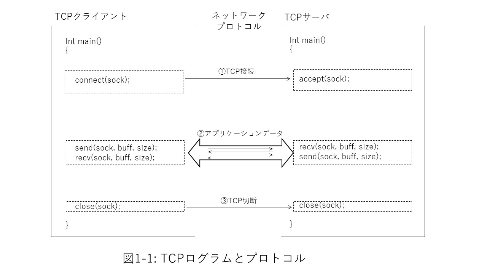
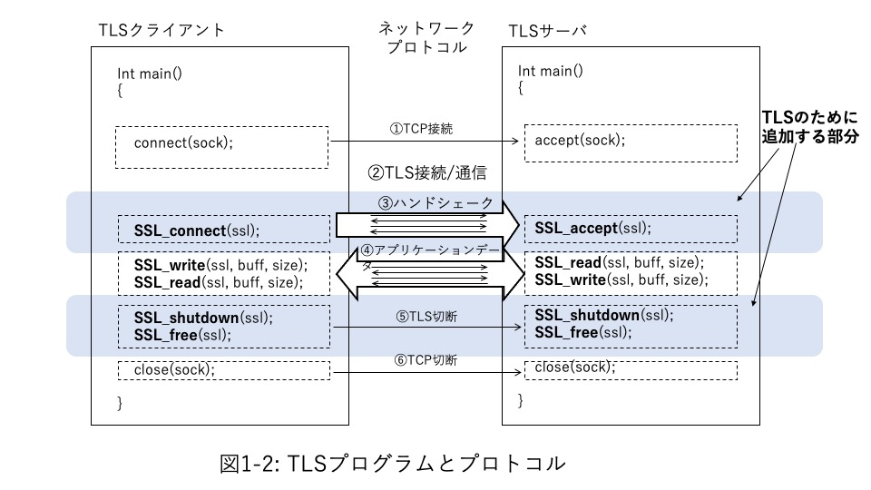

## Part 1 TLS technology
In Part 1, we'll look at the technology on which TLS programming is based. Chapter 1 provides an overview of the TLS protocol, starting with extending a simple C-based TCP client and server program to TLS clients and servers.

Chapter 2 describes the TLS protocol, with a particular focus on TLS 1.3. In Chapter 3, in order to understand the protocol in more detail, we will look at the cryptographic algorithms and technologies used for TLS, especially in relation to TLS. Chapter 4 summarizes the standards that support TLS, and Chapter 5 summarizes security considerations in TLS programming.

## 1. Simple TLS program
### 1.1 TCP client, server
In Chapter 1, we will look at how TLS programs and protocols are realized with simple client and server programs in C language. This sample program is a simple program that simply disconnects after sending and receiving one round-trip application message from the client to the server and from the server to the client after a TCP or TLS connection. You can see most of the main components that make up it.

All TLS protocols are implemented on top of TCP protocol connections. Figure 1-1 first outlines a simple client and server program for TCP-only network communication. If the pre-processing on the program is omitted, in TCP communication, the server first enters the waiting state so that the connection request from the other party (client) who wants to communicate with this server can be accepted. To do this, for example, a program with BSD sockets calls accept. On the other hand, the client issues a connection request to the server with which it wants to communicate. Call connect on BSD sockets. When this request is accepted by the server, a TCP connection is established (Fig. 1-1 ①), and TCP communication is possible between the client and the server.

After that, this connection is used to repeatedly send and receive messages between the client and server as needed by the application (Fig. 1-1②).

When the necessary message transmission / reception is completed, the TCP connection is disconnected 1 (Fig. 1-1 (3)).

   

   

### 1.2 Add TLS layer

Then add TLS layer processing to this TCP client and server program. Figure 1-2 shows a program with TLS processing added. Since TLS performs all communication over the TCP protocol, the TCP program connection (Fig. 1-2 ①) and disconnection process (Fig. 1-2 ⑤) are exactly the same as in Fig. 1-1. All TLS records will be transferred on top of the TCP records between TCP-connected clients and servers.

The server-side program then calls SSL_accept to wait for a TLS layer connection request. The server side is now waiting for a TLS connection request from the client. On the other hand, the client-side program calls SSL_connect for a connection request. This call performs a series of TLS handshakes between the client and server. In the handshake, the cipher suite (combination of cryptographic algorithms) used for TLS communication is agreed, and the cryptographic key used for the TLS session is agreed. Also, make sure that secure communication can be ensured by authenticating that you are a legitimate partner. If all of these steps are completed successfully, a TLS connection will be established (Fig. 2-1 (3)).

After the TLS connection is established, send and receive the target application data (Fig. 2-1 (4)). This is done programmatically by the SSL_read / SSL_wrote API. The plaintext message that the application wants to send is encrypted by SSL_write, decrypted by SSL_read and passed in cleartext to the other application. At this time, it also checks that the message received as part of the TLS protocol processing has not been tampered with from the source message and that it is authentic.

When the transmission / reception of application data is completed, disconnect in the order of TLS and TCP (Fig. 2-1 ⑤, ⑥).

   

   

You can refer to the sample programs and Makefiles of clients and servers that can be actually compiled and executed, including variable definitions, preprocessing, and error handling used in the programs, in the sample programs in this manual. Please refer to that as well.

### 1.3 Overview of TLS Protocol