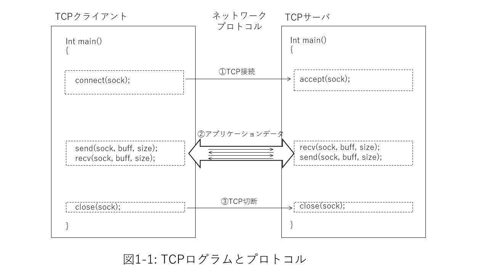
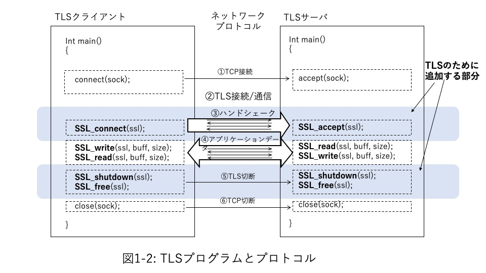

## Part 1 TLSの技術
Part 1では、TLSプログラミングのベースとなっている技術について見ていきます。第一章では、C言語ベースの簡単なTCPクライアントとサーバプログラムをTLSによるクライアントとサーバに拡張するところからスタートし、TLSプロトコルの概要を紹介します。

第二章では、TLSプロトコルについて特にTLS1.3を中心に解説します。第三章ではプロトコルをさらに詳細に理解するために、TLSに使われている暗号アルゴリズム、技術について、特にTLSとの関連で見ていきます。また、第四章では、TLSを支える標準について、第五章ではTLSプログラミングにおいてセキュリティ上考えておくべき事項についてまとめます。

## 1. 簡単なTLSプログラム
### 1.1 TCPクライアント、サーバ
第一章では、TLSのプログラムとプロトコルがどのように実現されているのか、C言語の簡単なクライアント、サーバプログラムでみていきます。このサンプルプログラムでは、TCPないしTLS接続の後、クライアントからサーバに、またサーバからクライアントに１往復のアプリケーションメッセージを送受信した後、接続を解除するだけの単純なプログラムですが、この中にTLSプロトコルを構成する主要な要素のほとんどをみることができます。

TLSプロトコルはすべてTCPプロトコルによる接続の上に実現されます。図1-1に、まずTCPだけのネットワーク通信のためのクライアントとサーバの簡単なプログラムの概略を説明します。プログラム上の前処理などを省略すると、TCP通信ではまずサーバ側ではこのサーバと通信したい相手（クライアント）からの接続要求を受け付けられるように待ち状態に入ります。これには、例えばBSDソケットによるプログラムではacceptを呼び出します。一方クライアントは通信したい相手のサーバに対して接続要求を出します。BSDソケットではconnectを呼び出します。この要求がサーバに受け入れられるとTCP接続が成立し(図1-1①)、クライアントとサーバの間でTCP通信ができるようになります。

その後、この接続を使ってクライアントとサーバの間でアプリケーションの必要に応じたメッセージの送信、受信を繰り返します(図1-1②)。

必要なメッセージの送受信が完了したらTCP接続を切断します１(図1-1③)。

  

  

### 1.2 TLS層を追加する

次にこのTCPクライアントとサーバプログラムにTLS層の処理を追加します。図1-2はTLSの処理を追加したプログラムです。TLSは全ての通信をTCPプロトコルの上でおこなうので、TCPプログラムの接続（図1-2①)、切断処理（図1-2⑤)は図1-1とまったく変わりません。TLSのすべてのレコードはTCP接続されたクライアント、サーバ間のTCPレコードの上に乗せて転送することになります。

次に、サーバ側プログラムではTLSレイヤーの接続要求を待つためにSSL_acceptを呼び出します。これでサーバ側はクライアントからのTLS接続要求待ち状態となります。一方、クライアント側プログラムでは接続要求のためにSSL_connectを呼び出します。この呼び出しでクライアントとサーバ間で一連のTLSハンドシェークが実行されます。ハンドシェークでは、TLS通信で使用する暗号スイート(暗号アルゴリズムの組み合わせ)を合意し、TLSセッションで使用する暗号鍵を合意します。また、正当な相手方であることを認証するなど安全な通信が確保できることを確認します。これらの手順がすべて正常に完了すればTLS接続が確立します（図2-1③)。

TLS接続が確立したら、目的とするアプリケーションデータの送受信を行います（図2-1④)。これはプログラム上ではSSL_read/SSL_wrote APIによって行います。アプリケーションが送信したい平文のメッセージはSSL_writeによって暗号化され、SSL_readによって復号化され相手方のアプリケーションに平文で引き渡されます。この時、TLSプロトコル処理の一環で受けとったメッセージが送信元メッセージから改ざんされていないこと、真正性のチェックも行います。

アプリケーションデータの送受信が完了したらTLS、TCPの順に切断します（図2-1⑤、⑥)。

  

  

プログラムに使用する変数定義や前処理、エラー処理などを含めた実際にコンパイル、実行可能なクライアントとサーバのサンプルプログラムとMakefileは本書のサンプルプログラム集で参照することができます。そちらのほうもあわせて参照してください。

### 1.3 TLSプロトコルを概観する

