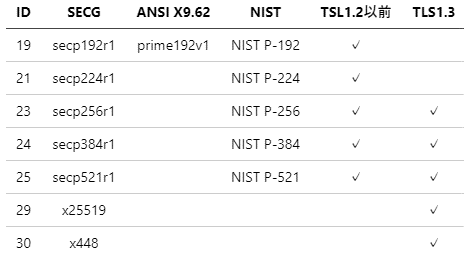
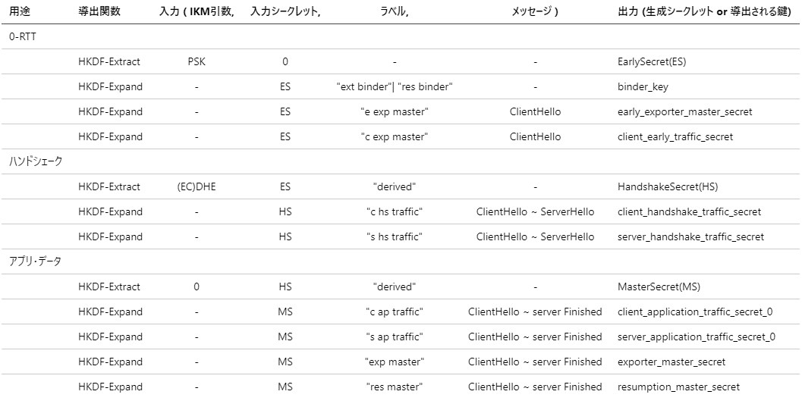
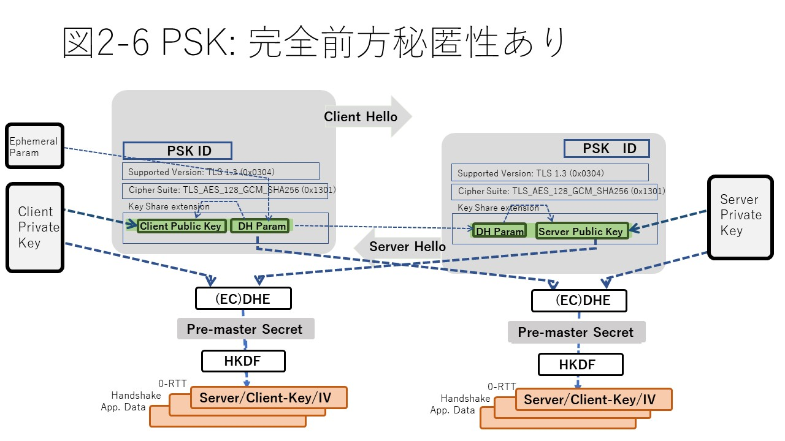

## はじめに
第２部では、TLSプログラミングのベースとなっている技術について見ていきます。まず、第二章ではTLSプロトコルについて、第三章ではそこに使われている暗号アルゴリズム、技術について、また、第四章では、関連する各種の標準について解説します。また、第五章ではTLSプログラミングにおいてセキュリティ上考えておくべき事項についてまとめます。

## 2.1 フルハンドシェイク
### 2.1.1 フルハンドシェイクの目的
「1.2 簡単なTLSプログラム」で説明したようにクライアントがはじめてサーバとTLS通信する際は、サーバは通信相手のクライアントに対して事前情報なしに安全なTLSセッションを確立する必要があります。これを行うのがフルハンドシェークです。

フルハンドシェークの主な目的は次の３つです。

１）通信の両者で使用する暗号スイートを合意すること 
２）セッションで使用する一連の鍵を合意すること（鍵合意） 
３）通信相手が正しい相手であること、成りすましがないことの確認すること（ピア認証） 

ピア認証とは、クライアントがサーバの正当性を認証するサーバ認証とサーバがクライアントの正当性を認証するクライアント認証の二つです。TLSの場合、サーバ認証は必須、クライアント認証はオプションとなっています。

### 2.1.2 暗号スイートの合意
ハンドシェークの主要な目的である暗号スイートと鍵の合意は、クライアントからサーバに最初に送られるClientHelloレコードとそれに対しするサーバからの応答ServerHelloレコードによって行われます。ここではまず、暗号スイートの合意に関する部分を見ていきます。図2-1はClientHelloとServerHelloについて、この様子を表したものです。

  

  

ClientHelloレコード、ServerHelloレコードにはTLS拡張とよばれるTLSセッションで必要となる各種の属性情報を格納するエリアがあります。暗号スイートの合意のためには次のようなTLS拡張に情報が格納されます。

１）supported versions拡張：サポートするTLSバージョンのリスト 
２）cipher suites拡張：サポートする暗号スイートのリスト 
３）supported group拡張：サポートする楕円曲線暗号の曲線リスト 

ClientHelloの各TLS拡張拡張にはクライアントが持っているそれぞれの選択肢の一覧が示されます。一方、ServerHelloのほうには、それに対してサーバが合意した選択肢が示されます。TLSハンドシェークでは通信の両者がこれらに合意した上で、アプリケーションデータの送受信に使用する共通鍵を鍵合意アルゴリズムで求めて実際の暗号通信を行うことになります。

以下、これをもう少し詳細に見ていきます。

#### 1) TLSバージョンの合意
TLSセッションを確立のためには、まず使用するTLSのバージョンについて合意する必要があります。

TLSでは、ネットワーク上で複数のTLSバージョンのプロトコルが混在できるように、ClientHelloではSupported Versions拡張にサポートする複数のバージョンを提示することができるようになっています(図2-2①)。これに対してサーバ側は合意したバージョンに対応する形式のServerHelloを返送します。これによって、それ以後のハンドシェークは合意したバージョンの形式で進めることができます。TLS1.3では、Secure Renegotiationは廃止されたので、ここでTLS1.3を合意した場合はその後すべて1.3に準拠する必要があります。

また、TLS1.3ではダウングレードは認められないので、クライアントが1.3を含む複数のバージョンを提示した場合でも、サーバ側はもしTLS1.3をサポートするならばかならず1.3で合意しTLS1.3のServerHelloを返却する必要があります。この時、ClientHelloに示される暗号スイートリストにTLS1.3スイートが無い場合はダウングレードの一種とみなされハンドシェークは終了します。また、TLS1.3で合意することを期待するクライアント側はこの値が規定されている値ではないことを確認し、ダウングレード攻撃を防止します。 

一方、サーバがTLS1.3を含む複数のバージョンをサポートする場合に、クライアント側がTLS1.2以下のみサポートする場合は、サーバ側もTLS1.2以下しかサポートしない場合と等価の動作をすることが認められています。ただし、その場合にはサーバランダムの後尾にその旨を示す特定のバイト列を表示します。 

表2-1にクライアント、サーバでサポートするTLSバージョンの組合わせと求められる動作についてまとめます。
  
 
 [表2-1  TLSバージョンの合意](./table2-1.md)
  

#### 2) 暗号スイートの種類
次に、使用する暗号スイートについて合意します。TLS1.3ではそれまでのバージョンにくらべて以下のように利用可能な暗号スイートの種類が大幅に整理されました。

１）鍵合意アルゴリズムとしては静的RSAを廃止し、一時鍵DH（楕円曲線DHを含む）のみとなりました。 
２）静的RSAが廃止されたため、証明書はピア認証のみに使用することになりました。これによって、鍵合意と認証は完全に分離、独立した扱いが可能となりました 
３）危殆化した共通鍵暗号アルゴリズムが大幅に整理されました 
４）MACによる真正性検証を廃止し、認証付き暗号(AEAD: Authenticated Encryption with Associated Data)アルゴリズムのみに整理されました 
５）ハッシュはHKDF鍵導出のためのハッシュアルゴリズムのみを指定するものとしました 

１）の整理により暗号スイート表記上は鍵合意アルゴリズムの表記は意味がなくなり、TLS1.3向け表記からは削除されました。また２）により、証明書に関する情報も暗号スイートとは分離し、必要な情報はTLS拡張に格納しています。

以上の結果、TLS1.2までに数百にのぼっていた暗号スイートは、現在TLS1.3として利用できるものとして以下の通りに絞り込まれまています。
  
 
 [表2-2 TLS1.3の暗号スイート](./table2-2.md)
  

鍵合意に関する情報は暗号スイートから分離され、ECDHに使用できる楕円曲線の種類については、別途TLS拡張(Supported Group)にリストを示します。Groupの種類として標準的な楕円曲線の種別ID、またDH向けには鍵長を示すIDが定義されています。

表2-3にSupported Groupで使用される主なGroupとIDの一覧を示します。
  
 
 [表2-3 Supported Groupで使用される主なGroupとIDの一覧](./table2-3.md)
  

#### 3) 暗号スイートの合意
ClientHell, ServerHellの往復では、これらの暗号スイートとともにSupported Groupで示される楕円曲線の種類を合意します。この時、TLSバージョンとしてTLS1.3を合意している場合、必ずTLS1.3の暗号スイートとKey Shareに示されるDHパラメータを合意する必要があります。

クライアントから示されるものに合意できるものが無い場合、サーバは再度のClientHello要求 (HelloRetryRequest) を一回だけ発行することができます。

TLSバージョンと暗号スイートに合意したら、サーバはKey Share拡張に示されるDHパラメータとクライアントのDH公開鍵を受け取ります。また、これに対してServerHelloでサーバのDH公開鍵を返します。これにより、両者それぞれでPre-Master Secret、またHKDFによりセッション鍵を導出します。

Key Share拡張にはデフィーヘルマン（楕円曲線DHを含む）鍵合意のためのDHパラメータとクライアント側のDH公開鍵を格納します。Key Shereには複数の候補を含むことができます。

#### 4) HelloRetry
クライアント側が提示したKeyShare拡張のリストに対してサーバ側が合意できない場合はクライアントに対して１回だけ別の候補を要求することができます(HelloRetryRequest)。これに対して、クライアント側は２度目のClientHelloで次の候補を示します。サーバ側がこれに合意できない場合はハンドシェークを中断します。提示されたリストに合意できるものがあれば各項目の合意する内容をServerHelloにて返却します。

### 2.1.3 鍵合意
ここまでで、TLSバージョン、暗号スイート、またDHのグループなどの詳細まで両者の間で合意できたので、実際にアプリケーションデータの送受信に使用する共通鍵を得るための鍵合意のプロセスに入ります。

  

  

ServerHelloのKey Shareには、ここまでの暗号スイート合意情報に加えてサーバ側のDH公開鍵も格納します。それらを受け取った両者は、自分の生成した秘密鍵とあわせてDHアルゴリズムによってプレマスターシークレットを算出することができます(図2-2の鍵合意)。プレマスターシークレットは、通信に使用する各種共通鍵のもとになる整数値です。TLS1.3では鍵合意にはすべてディフィーヘルマン(DH)系のアルゴリズムが使用されます。鍵合意、ディフィーヘルマンアルゴリズムについては第三章3.5 公開鍵暗号で説明します。

TLS1.3ではこのようにClientHelloとServerHelloレコードの1往復のやりとりでセッション鍵の導出まで完了しますが、TLS1.2以前では２往復を要していました。これは、TLS1.2以前では、ClientHelloとServerHelloレコードでは暗号スイートの合意までしか行わず、鍵合意のためのサーバ鍵、クライアント鍵は次のServerKeyExchange, ClientKeyExchangeに交換されるためです。また、TLS1.3ではハンドシェークの最初でセッション鍵が導出できるので、それ以降のハンドシェークを秘匿することが可能となり安全性を高めています。このようなことが可能になったのは鍵合意アルゴリズムとしてDH系のみに絞られたことが大きな理由です。

### 2.1.4 鍵導出

TLSではプレマスターシークレット値をもとに鍵導出アルゴリズムによってその後の共通鍵暗号による暗号化、復号化のための鍵、IVを導出します(図2-2の鍵導出)。鍵導出のアルゴリズムはTLS1.1から1.2にかけてTLS向けとして独自に改善されてきましたが、TLS1.3ではHMAC-SHA256ベースのより汎用の鍵導出アルゴリズムであるHKDF(HMAC key derivation function、RFC5869)が採用されています。これによって、鍵、IVは送信元（サーバ側、クライアント側）によって、またハンドシェーク中、アプリケーションデータ転送、0-RTTなどの用途により異なる値を導出しセッション鍵とすることで安全性をさらに高めています(表2-4)。
  
 
 [表2-4 TLS1.3における鍵導出スケジュール](./table2-4.md)
  

### 2.1.5 ピア認証

#### 1) 概要
ハンドシェークのもう一つの主要な目的はピア認証（クライアントによるサーバ認証、サーバによるクライアント認証）です。TLSではサーバ認証は必須、クライアント認証はオプショナルです。しかし、サーバ側がクライアント認証を要求した場合はクライアント側は必ずそれに応答する必要があります。
  

  
図2-3は、クライアントとサーバプログラムとサーバ認証に使用される証明書や鍵、またプロトコルとの関係を示します。TLSプログラム上、クライアント側ではサーバ認証のためにあらかじめに信頼するCAの証明書をロードしておきます。サーバ側では、CAによって署名されたサーバ証明書とプライベート鍵をロードしておきます。

ハンドシェークでは、サーバ側はロードされたサーバ証明書をCertificateレコードにてクライアントに送信します。また、プライベート鍵によって作成した署名をVerifyCertificateレコードにて送信します。受け取ったクライアント側では、証明書の有効期限のチェックなどとともに、ロードされたCA証明書で送られてきた証明書の真正性を検証したうえで、格納されている公開鍵によって送られてきた署名を検証します。

#### 2) 証明書チェーン
現実の運用では、CAが階層化されていてサーバ証明書に署名するCAは信頼するCA自身ではなく、その下位に属する中間CAであるケースも多々あります。また、その中間CA自身も信頼するCAの直接の下位CAではなく、さらに中間CAが存在する場合もあります。そのような場合、サーバはサーバ証明書だけではなく中間CAの証明書も含めてチェーン証明書としてクライアントに送信します。受け取ったクライアントは、サーバ証明書をその上位の中間CAの証明書に含まれている公開鍵で検証し自分の保持している信頼するCA証明書までチェーンがつながることを確認します。

#### 3) クライアント認証
クライアント認証では、ほぼこれと同じことをクライアントとサーバを対称にした形で行います。ただしクライアント認証のほうはオプショナルなので、サーバ側は必要に応じてクライアントに対して認証要求(CertificateRequest)を送信します。

ピア認証のプロトコルに関して、TLS1.2まではサーバ側から送られる署名はServerKeyExchangeに格納されるなど、プロトコル上一部対称でない部分がありましたが、TLS1.3では上記のように認証する側と認証される側で対称となるように整理されました。

#### 4) 認証に関するTLS拡張
ピア認証に関するアルゴリズム情報は各々のTLS拡張に格納されています。署名に使われるアルゴリズムの組み合わせ（スキーム）はハッシュアルゴリズムとそれに署名するための公開鍵アルゴリズムで規定されます。証明書の署名スキームとしてサポートするものは署名アルゴリズムTLS拡張(Signature Algorithms)にそのリストが格納されます。TLS1.3では、署名部分としてRSAとECDSAが標準として定義されています。RSAの場合、パディング方式も定義します。ECDSAの場合、楕円曲線の種類もここで規定します。ハッシュとしてはSHA1またはSHA2が使用されます。

表2-5にTLS1.3で使用できる署名スキームの一覧を示します。
  
 
 [表2-5 TLS1.3で使用できる署名スキーム一覧](./table2-5.md)
  

#### 5) OCSP Stapling

公開鍵証明書は、秘密鍵の流出など不測の事態には有効期限内でも失効させることができます。このため、受け取り側は受け取った証明書の有効性について確認する必要があります。証明書の有効性情報の入手は当初CRLやOCSP(Online Certificate Status Protocol)のようにTLSハンドシェークのスコープの外で、クライアントとCAないしCAを代理するOCSPレスポンダー間のやりとりで実現されていました。しかし、その後改版されたOCSP Stapling ではハンドシェークの一部としてTLS拡張に取り込まれ、TLS1.3でそれらが整理され現在に至っています。

OCSP Stapling では、ピア認証される側(サーバ認証の場合、サーバ側）で証明書と同時に証明書の有効性情報を用意しておきます。そのため、認証する側(サーバ認証の場合クライアント側)はTLSセッションを確立しようとしている相手側とのハンドシェークのみ有効性確認をすることができます。認証される側は、複数の
認証要求を束ねて(Binding)OCSPレスポンダーに要求を出せるので、レスポンダーとの間のトラフィックを大幅に削減することができます。

TLS1.3では、ピア認証プロトコルはサーバ認証、クライアント認証でほぼ対称になるように整理されました。これに伴ってOCSP状態確認要求もどちらの認証にも要求できるようになりました。サーバ認証の場合は
ClientHelloにOCSP_status_request拡張を、クライアント認証の場合はCertificateRequestレコードにstatus_reques拡張を乗せて要求を出します。

OCSPからの有効性情報は証明書チェーンの証明書と対応して、各々のCertifycateEntryの中に署名されたOCSPレスポンスが返却されます。このときタイムスタンプもあわせて返却されるので認証する側はステータス情報の鮮度を確認することができます。

## 2.2 事前共有鍵とセッション再開
### 2.2.1 事前共有鍵(PSK)

#### 1) PSKプログラム
事前共有鍵(PSK: Pre-shared Key)を利用すると、通信する両者が別途何らかの方法で鍵を合意しておいてそれを利用して通信することができます。PSKを使用することでハンドシェークを簡略化することができます。事前に複数の鍵を共有しておくことができ、その場合は鍵とIDのペアを共有しておきます。ハンドシェーク冒頭のClientHelloでセッションで使用したい鍵のIDをサーバ側に伝えます。サーバ側では、このIDに対応する鍵を事前に共有している鍵の中から選びセッションに使用します。事前に１つの鍵しか共有していない場合はIDを省略することもできます。いずれにせよ、ハンドシェークではIDのみを伝え、鍵そのものがネットワーク上に送信されることはありません(図2-4)。
  

  
プログラム上では、PSKに使用する鍵とIDを管理する部分をTLSプロトコルを共通に取り扱うライブラリーから切り離すためにPSKコールバック関数を定義してライブラリーに登録できるようになっています。TLSのコンテクストを確保した後、そのコンテクストにコールバック関数を登録するとライブラリは以後、フルハンドシェークではなくPSKによる接続を実行します。また、ハンドシェーク開始時には登録したコールバック関数が呼び出されます。

クライアント側のコールバック関数では、使用したい鍵のIDとその鍵の値をアーギュメントに返します。受け取ったライブラリーは、IDをClientHelloのPre-Shared Key拡張に格納してサーバ側に送信します。受け取ったサーバ側では、同じように登録されたサーバ側のPSKコールバック関数のアーギュメントにIDを渡し、コールバック関数はそのIDから該当する鍵をさがし、その値をアーギュメントに返します。

#### 2) PSKプロトコル
TLS1.3のPSKでは、IDで示された事前共有鍵をそのまま使用することも可能ですが(図2-5)、その鍵を利用してフルハンドシェークの場合と同様の鍵合意を行いそれをセッション鍵として使用するモードも用意されています。事前に共有した鍵をそのまま使用し続けてしまうと、いったんセッション鍵がやぶられた場合に以前のセッションにさかのぼってすべてのセッションの秘匿性が崩壊するいわゆる前方秘匿性リスクを招いてしまいます。そのリスクを回避するために、TLS1.3からはPSK鍵を使ってさらにディフィーヘルマン(DH)による鍵合意をすることが推奨されています。
  

  
この場合、図2-6に示すようにクライアントプログラムでSSL_connectが呼ばれると、PSKのハンドシェークが開始されます。デフォルトでは、クライアントとサーバで使用するPSKが確定したらそれを使ってDHによる鍵合意も行えるように、ClientHelloにはPre-Shared Key拡張の鍵IDとともに、Key Share拡張内にDHパラメータとクライアント側のDH公開鍵も格納されます。サーバ側でもKey Share拡張にサーバ側のDH公開鍵を返します。
  

  
クライアント、サーバ双方がDHによる鍵合意を行わないことに合意している場合は、PSKの鍵をそのまま使用することになります。プログラム上でTLSコンテクストを確保した後、あらかじめそのコンテクストに対して指示しておくことで、ライブラリーをそのように動作させることができます(wolfSSLではwolfSSL_CTX_no_dhe_psk)。

### 2.2.2 セッション再開 
TLS1.3では、セッション再開はPSKの拡張として整理されていて、再開時のプロトコルはPSKプロトコルに準じます。再開時のPSK鍵としては、以前に確立したTLSセッションで交換しておいたセッションチケットを使用します。サーバ側は安全なTLSセッションが確立した後、ポストハンドシェークプロトコルの一つとしてセッションチケットをクライアントに送ることができます。クライアント側では、送られてきたセッションチケットをセッション再開時に使用します(図2-7)。
  

  

TLS1.2以前では、セッション再開のためにはセッションIDによる方法とセッションチケットによる方法のふたつがありました。セッションIDでは、クライアントがClientHelloの空のセッションID拡張でセッションIDを要求すると、サーバ側は対応するセッションID値をServerHelloのセッションID拡張で返却します。クライアントは再開要求の際にはこのセッションIDを使用して再開要求します。セッションチケットも同様にセッションチケット拡張によってチケットを入手し再開時にそれを使用します。

セッションIDによるセッション再開は、サーバ側にそのステータスを何らかの形で保持する必要がり負担をかけることになります。チケットの場合は、再開時に必要な情報はすべてチケット内に含まれているのでその点ではサーバ側の負担は増加しません。

TLS1.3ではそれまでのセッションIDは廃止され、セッション再開はセッションチケットに統一されました。また、ClientHelloのセッションチケット拡張は廃止され、あるセッションを再開させる可能性がある場合はサーバが前のセッションでチケットを送付します(「2.4 ハンドシェーク後プロトコル」を参照)。

### 2.2.3 Early Data
PSKやセッション再開の場合、ハンドシェークを待たなくても直前のセッションの鍵情報を利用することで情報を秘匿することができます。TLS1.3ではTLSセッションの冒頭のClientHelloにEarly Data拡張と呼ばれるTLS拡張を設け、アプリケーションデータを格納し暗号化して送信することができるようになっています。Early DataはRound Trip無しの秘匿化したメッセージであることから0-RTTとも呼びます。

ただし、この暗号化は前のセッションの鍵情報を引き継いで使用しているため、前方秘匿性を犠牲にしていることに注意が必要です。また、この機能はリプレイ攻撃に対して防衛手段を持たない点にも注意して使用する必要があります。Early Dataを受信するサーバ側で何等かの自衛手段がとれるように、送信側があらかじめ両者で合意した特定のパターンのデータ以外は送信しないなど特別の配慮をする必要があります。

Early Dataはプロトコル上は単にClientHelloに専用のTLS拡張を乗せるだけなので、ハンドシェークの流れとして大きくかわることはありませんが、プログラム上はライブラリーの用意するEarly Dataの送信、受信のためのAPIを利用することになります。具体的なプログラミングについては「第二部TLSプログラミング」で説明します。

## 2.3 その他のTLS拡張

TLSでは、現実のネットワーク通信で必要となるさまざまな要件を満たすために目的別のTLS拡張を設けています。ここでは主要なTLS拡張について説明します。

#### 1) サーバ名表示(SNI: Server Name Indication)
初期のインターネットでは、通信の送受信の端点である物理的なサーバとIPアドレスは１対1に対応していて、TCPやTLSによる通信もそれを前提とした端点間の接続を前提としていました。しかし、仮想化技術などの進歩によって、物理的な端点であるIPアドレスが必ずしも目的とする通信相手の単位と一致しないケースが多々でてくるようになってきました。それを解決するために、目的とする論理的な通信相手を示すためにSNI拡張が設けられました。

クライアントはTLS接続したい論理的なサーバのサーバ名をClientHelloのSNI拡張に格納します。サーバはSNI拡張に自分のサーバ名が示された場合のみに応答し、自分のサーバ証明書を返信します。これによってクライアントは論理的なサーバ名をもつサーバ毎に区別して、サーバ認証を行うことができます。SNI機能が成立するためには、クライアント、サーバの双方がSNIに対応する必要があります。

#### 2) Maximum Fragment Length Negotiation
ネットワーク上につながる通信ノードは必ずしもメモリーを潤沢に搭載したマシーンとは限りません。IoTデバイスのように小型の組込み機器では通信に使用できるメモリー容量が限定されているケースも多々あります。そのような場合問題となる点の一つは暗号化されたTLSレコードのサイズです。TLSでは送信しようとするアプリケーションデータのサイズが大きい場合、TLSのレコードとしては最大16kバイトごとに分割して送信することになっています(Maximum Fragment Length)。しかし、小型の組込み機器などではさらに小さなレコードに分割しなければならないケースが出てきます。その場合、TLS通信を開始しようとするクライアントは希望する最大レコードサイズをMaximum Fragment Length拡張に表示し、サーバがこれを受け入れた場合には、そのサイズを最大レコードサイズとする通信が行われます。

#### 3) Certificate Status Request
OCSP Staplingはピア認証のための証明書の有効性チェックをオンラインで行うためのプロトコルです。Certificate Status Request拡張は、TLS接続の相手方に対してOCSP(Online Certificate Status Protocol) staplingを要求するための拡張です。OCSPとOCSP Staplingについては「第４章：TLSに関連する標準」で説明します。

#### 4) ALPN: Application-Layer Protocol Negotiation
ALPN拡張はTLS接続の上で利用するアプリケーション層のプロトコルをあらかじめ示しておくための拡張です。本来、インタネットプロトコルの階層はそれぞれ独立しているのが原則ですが、ALPN拡張はTLS接続後のアプリケーション層でのネゴシエーションのための余分なハンドシェークを回避するために設けられました。現状ではSPDY, HTTP/2などで利用されています。

#### 5) その他のTLS拡張
そのほか、TLS1.2までに利用されいたいくつかのTLS拡張がTLS1.3で整理されました。

extended_master_secret拡張はTLS1.2の時代に認識された脆弱性に対処するために設けられた拡張です。マスターシークレットを算出するための要素の一つであるハッシュ値を求める範囲を通信の最初の部分であるClientHelloにまで拡張することを示します。TLS1.3ではこのハッシュ範囲の拡張は必須となったためTLS拡張としては廃止されました。

encrypt_then_mac拡張はTLSレコードのMAC値を求めるのに、データを暗号化してからMAC値を求めることを示すものです。また、Truncated HMACはMAC値として通常よりも短いビット数の値を使用するためのものです。TLS1.3ではMAC値による真正性チェックはAEADによる共通鍵暗号にゆだねられるためこれらのTLS拡張は廃止されました（「第五章 安全性、脆弱性」参照）。

Compression Methods拡張は、アプリケーションデータの圧縮方式を示すための拡張でしたが、圧縮されたデータの規則性が脆弱性の原因となるリスクがあるためTLS1.3ではプロトコルとしてのデータ圧縮は廃止されました。ec_point_formats拡張も楕円曲線暗号の鍵情報の圧縮方式を示す拡張ですが、同様の理由で廃止されました。

  
 
 [表2-6 TLS1.3のTLS拡張](./table2-6.md)
  

[表2-5: TLS1.3のTLS拡張](table2-5-TLS13Extension.md)

## 2.4 ハンドシェーク後のプロトコル
ハンドシェークでTLS接続が成立すると目的とするアプリケーションデータの送受信に入りますが、それ以外にもいくつかの補足的なプロトコルが定義されています。

#### 1) セッションチケット
セッションチケットは前述のセッション再開時に利用するデータです。サーバはハンドシェークが完了し安全なセッションが確立した後、適当なタイミングでセッションチケットを送信することができます。クライアントは受信したセッションチケットを次回のセッション再開時に使用します。サーバは、クライアント側に複数のセッションの同時接続を許すような場合、複数回セッションチケットを送信することができます。

#### 2) 再鍵生成、再認証
TLS1.3では、セッションが長期にわたる場合や大量のデータを転送する場合に、適当なタイミングでセッション鍵を再生成することができます。セッション鍵はそのセッションのマスターシークレットから鍵導出アルゴリズムを使って再生成され、新しい世代の共通鍵として使用されます。

同様にセッション中に再度ピア認証を要求することもできます。その場合はフルハンドシェークの時と同様に、Certificate Requestレコードによって相手方に認証を要求し、返信されるVerify Certificateレコードによって認証します。

参照RFC：
[表2-7: TLS1.3関連RFC](table2-7.md)
