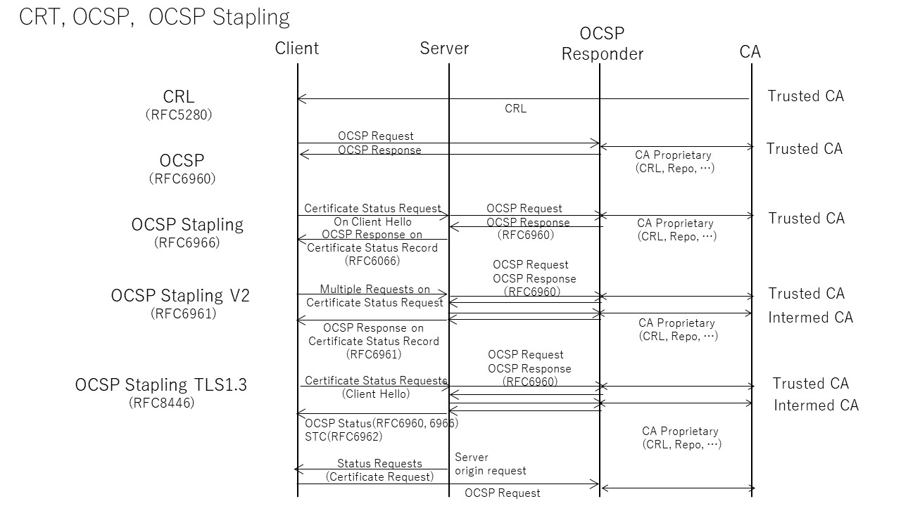

### 2) Certificate validity and revocation

#### 2-1) CRL
The public key certificate can be revoked even before the expiration date in the event of an unforeseen situation such as the leakage of the private key. A list of revoked certificates is available from the CA as a Certificate Revocation List (CRL). Clients can check However, the client itself has to check the certificate information in the CRL, which becomes a burden on the client as the network size increases and the list size increases.

#### 2-2) OCSP
To reduce such burden on clients, OCSP (Online Certificate Status Protocol) was developed as a protocol that asks the OCSP responder for the validity of only the received certificate (RFC6960: X.509 Internet Public). Key Infrastructure OCSP). In the case of OCSP, the client sends the serial number of the certificate for which you want to confirm the validity to the OCSP responder, and the responder returns the confirmation result for the inquired certificate, which reduces the processing load on the client. However, since there is no stipulation as to how the responder obtains the revocation information, the real-time property of the revocation information itself referred to by the responder is not guaranteed.

#### 2-3) OCSP Stapling
Early OCSP specified a protocol independent of TLS for obtaining certificate status information. However, in the later developed OCSP Stapling, the client can request the validity of the certificate from the server instead of the OCSP responder as part of the TLS handshake, and the validity Of the certificate can be judged only by the confirmation result from the server. It came to be. Specifically, it uses the Certificate Status Request, which was added as one of the TLS extensions in RFC 6066 to the request from the client. Along with This, Certificate Status has been added to the handshake record. The server returns the certificate status by putting an OCSP Response on the Certificate Status record.

#### 2-4) OCSP Stapling Version 2
It is necessary to check the validity of the certificate for the certificate including the intermediate CA, but TLS1.2 has a limitation that only one certificate status request extension can be provided for one Client Hello, so the intermediate CA certificate Could not request including the status of the book. To solve this, RFC6961 (Multiple Certificate Status Request Extension) has been amended and extended as OCSP Stapling version 2. In version 2, the server also responds directly to the CA with a validation time stamp (RFC6962: Signed Certificate) Timestamp). This allows the client to verify the validity of the certificate, including the freshness of the response. Since the server side can also bundle the validity confirmation requests to the CA as much as the freshness allows, it has become possible to significantly reduce the load on the CA that responds to inquiries.

#### 2-5) TLS 1.3 OCSP Stapling
TLS1.3 eliminates this obstacle by allowing the certificate status of multiple OCSP responders to exist. For this reason, in TLS 1.3, the multiple certificate status extension specified by RFC6961 is abolished in the status confirmation request from the client, and the original certificate status request of RFC6066 is adopted. As for the response from the server, an RFC6066 compliant OCSP Response is provided along with the corresponding certificate in the Certificate Entry extension.

TLS 1.3 also adds a Certificate Timestamp (RFC6962) to allow clients requesting status to determine the freshness of that information. With the cleanup of TLS extensions for requests and responses, it is also possible for the server to make similar certificate status requests to clients. In this case, the server issues a request with status_reques on the CertificateRequest.
(RFC8446 Section 4.4.2.1).

