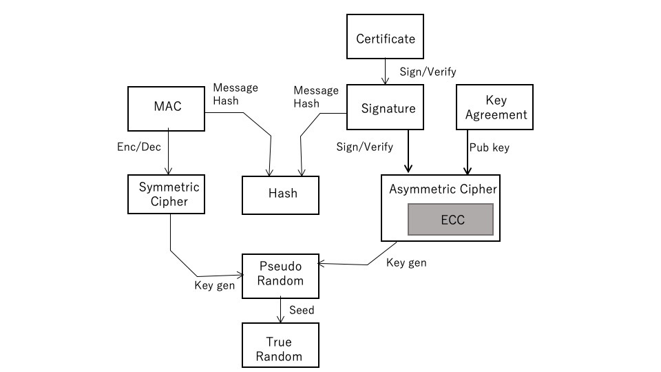

## 3.1 Overview
Among information and communication technologies, digital encryption technology is a basic technology that has developed rapidly in recent years and is used in a wide range of fields. This chapter summarizes the cryptographic techniques and algorithms used in TLS in particular. Figure 1.1 shows these cryptographic elements and their relationships, with arrows showing the technical element dependencies.

As shown in this figure, many of these techniques are built on the unpredictability of random numbers. In addition, these cryptographic technologies are made up of complex cryptographic technologies for different purposes combined with the three elemental technologies of hash, symmetric key cryptography, and public key cryptography.

   

   

### 1) Random numbers
Random numbers are the basis of all modern cryptographic algorithms, and their cryptographic strength depends on the quality of the random numbers used. Intrinsic random numbers are pure random numbers with no periodicity or statistical bias. It is not easy to obtain high quality true random numbers, and it is not possible to obtain true random numbers only with algorithms that operate deterministically, such as software.

Pseudo-random number is a technology that gives the original random number seed value from the outside and deterministically generates a random number sequence with a sufficiently long cycle and little statistical bias. Pseudo-random numbers are used to obtain high-quality random numbers by seeding them when it is difficult to directly generate high-quality true random numbers. Also, since the same random number sequence is generated when the seed values ​​are the same, it is also used in applications that require reproducibility, such as simulation.

In TLS, deriving various keys used in a session from a premaster secret is also called pseudo-random number generation. Also, the generation of bit strings for stream cipher keys can be seen as one of the pseudo-random number generation.

### 2) Hash
Hash, also called message digest, is a unidirectional algorithm for compressing long messages with indefinite length into short fixed length data. Since the data is compressed, there is a possibility that the same hash value will be generated from different original messages (hash collision), and there is a risk that the original message will be inferred from the hash value (original image calculation), so the algorithm used is Such risks are required to be minimized.

### 3) Symmetric key
A cryptographic algorithm that uses the same key for encryption and decryption is called symmetric key cryptography. Since it can efficiently encrypt and decrypt large amounts of data, TLS uses it as an encryption algorithm when transferring application data.

However, when there is a possibility of communicating with a large number of potential parties such as network communication, there is a problem of how to safely pass the key to the other party (key delivery problem). In TLS, cryptographic communication is performed by common key cryptography after securely sharing the same key with the other party of communication using public key cryptography (key exchange, key agreement).

### 4) Message authentication code (MAC)
In network communication, the issue is to confirm that the received message has not been tampered with (integrity). Algorithms for that purpose, message authentication code (MAC) includes HMAC using hash (Hash based MAC), AES-MAC using common key cryptography, and so on. A common key is used for MAC verification, and only the legitimate owner of the key can verify the integrity of the message. However, there is an increasing need for message authentication to be performed in smaller units, and message authentication is being incorporated as part of common key cryptography.

On the other hand, traditional TLS used its own algorithm for key derivation, but TLS 1.3 uses the more general HMAC.

### 5) Public key, key exchange and signature
Public key cipher (asymmetric key cipher) is an cipher algorithm that uses different keys for encryption and decryption, and since both keys are different, the encryption key (public key) is passed to the other party for encryption. You can receive the message and securely decrypt it with the decryption key (private key, private key) that is not disclosed. A key exchange algorithm using public keys can solve key delivery problems. However, since the processing of public key cryptography takes an extremely large processing time compared to common key cryptography, in TLS, after the same key value is obtained by key exchange with the public key in the first handshake, it is common. It is used as a key for key cryptography to efficiently encrypt and decrypt a large number of messages.

Public key signature is a digital signature algorithm that utilizes the unidirectionality characteristic of public key cryptography. In TLS, public key signatures are used as a means of peer authentication to prevent spoofing of the other party. To prove your legitimacy as a communication partner, first sign an appropriate message (Blob) using the private key for your signature along with the certificate containing your public key (described later). Will be sent. The recipient verifies that the signature on the Blob is correct with the public key stored in the certificate.

### 6) ECC
Elliptic curve cryptography (ECC) defines points on the elliptic curve and scalar operations on them. While RSA and DH are based on the difficulty of inverse calculation of discrete logarithm, elliptic curve cryptography encrypts that if the scalar value is large enough, it becomes difficult to calculate the inverse of scalar multiplication for points on the ellipse. It is used for conversion. ECDH can use this elliptic curve operation to safely obtain a common key for both parties communicating in a Diffie-Hellmann-like manner. ECC is also used as an algorithm for digital signatures.

In general, ECC can achieve comparable cryptography with shorter keys than algorithms that rely on prime numbers such as RSA. Elliptic curve cryptography has a slightly complicated algorithm, but it tends to take less time as an actual algorithm execution time because it is easy to perform power operations that should have a short key. Recently, special elliptic curves that simplify arithmetic processing have also been studied and used practically.

### 7) Certificate and Public Key Infrastructure (PKI)
The public key certificate is a signature of the public key and other meta information stored. The certificate is signed by a certificate authority (CA), which is trusted by both parties, using the private key of the certificate authority. The person trying to communicate can use the certificate of the trusted CA to verify that the certificate sent by the other party is a legitimate certificate signed by a certificate authority. You can also use the public key of the communication partner stored in the certificate to authenticate the validity of the communication partner.

Public key infrastructure (PKI) is a trust model based on a certificate authority, which is a trusted third party using public key cryptography, certificates, etc., and standard rules for realizing it. .. A set of specific standards for PKI is PKCS (Public Key Cryptography Standards) (PKCS), which RSA has worked on since the early stages of public key technology. PKCS is numbered by the standard category and is still available. Many categories are used as standard conventions in a wide range of fields. TLS as a protocol is also created on the premise of the existence of PKCS-based PKI.