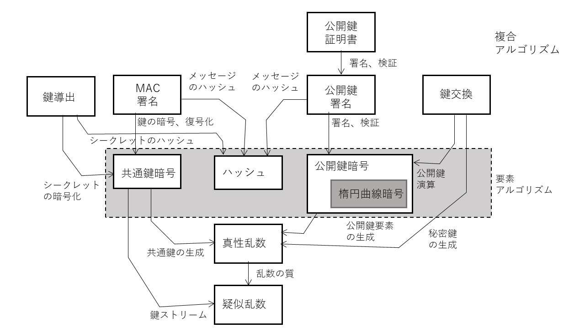

## 3.1 概要
　情報通信技術のなかでもデジタル暗号技術は近年急激に多岐にわたり発展した基盤技術で、幅広い分野で利用されています。この章では特にTLSで使用される暗号技術、アルゴリズムについてまとめます。図1.1はそれらの暗号技術要素とその関連を示したもので、矢印は技術要素の依存関係を示します。

この図に示すように、これらの技術の多くが乱数の予測不能性に依存して組み立てられています。また、これらの暗号技術はハッシュ、共通鍵暗号、および公開鍵暗号の３つの要素技術と組み合わせた目的別の複合的な暗号技術とからできています。

  

  

### 1) 乱数
　乱数はすべての近代の暗号アルゴリズムの基本となるもので、その暗号強度は利用する乱数の質に依存しています。真正乱数は周期性や統計的な偏りがない純粋な乱数です。質の高い真正乱数を得ることは容易ではなく、特にソフトウェアのように決定論的に動作するアルゴリズムだけでは真正乱数を得ることはできません。

疑似乱数は、もととなる乱数シード値を外部から与え周期が十分に長く統計的な偏りの少ない乱数列を決定論的に生成する技術です。疑似乱数は、質の高い真正乱数を直に生成するのが難しい場合に、真正乱数をシードとして質の高い乱数を得るために使用されます。また、シード値が同じ場合同一の乱数列を生成するので、例えばシミュレーションのように再現性が必要な応用でも利用されます。TLSの中ではプレマスターシークレットからセッションで使用する種々の鍵を導出する際にも使用されます。ストリーム暗号の鍵ビット列の生成も一種の疑似乱数生成と見ることができます。

### 2) ハッシュ
　ハッシュはメッセージダイジェストとも呼ばれ、不定長の長いメッセージを固定長の短いデータに圧縮するための単方向性のアルゴリズムです。データを圧縮するため異なるオリジナルメッセージから同一のハッシュ値が生成される（ハッシュ衝突）可能性や、ハッシュ値からもとのメッセージを推測される（原像計算）リスクがあり、使用するアルゴリズムにはそうしたリスクが最小となることが求められます。

### 3) 共通鍵暗号
　暗号化と復号化に同じ鍵を使用する暗号アルゴリズムを共通鍵暗号（対称鍵暗号）と呼びます。共通鍵暗号は大容量のデータを効率的に暗号化、復号化できる特徴があるので、TLSではアプリケーションデータ転送時の暗号アルゴリズムとして使用します。使用する鍵は乱数生成によって通信の都度生成します。

しかし、ネットワーク通信のように潜在的に多数の相手方と通信する可能性がある場合には使用する鍵を相手方にどのように安全にわたすかという問題（鍵の配送問題）を抱えています。TLSでは、公開鍵暗号の技術を使って通信の相手方と安全に同一の鍵を共有した上で（鍵交換、鍵合意）共通鍵暗号によって暗号通信を行います。

### 4) 公開鍵暗号と鍵交換
　公開鍵暗号（非対称鍵暗号）は暗号化、復号化に異なる鍵を使用する暗号アルゴリズムで両者の鍵が異なるため、暗号化のための鍵（公開鍵）を通信の相手方に渡して暗号化したメッセージを受け取り、公開しない復号化のための鍵（プライベート鍵、秘密鍵）で安全に復号化することができます。公開鍵の代表的アルゴリズムRSAは素因数分解の困難性を利用した公開鍵アルゴリズムで、TLSの初期には共通鍵暗号に使う鍵を暗号化して配送するためのアルゴリズムとして広く使用されました。

一方、もう一つの公開鍵アルゴリズムであるディフィーヘルマン(DH)は共通鍵を暗号化するのではなく、公開してもよい共通情報をベースに通信する両者でそれぞれ生成した秘密鍵を使って、通信する両者に共通の鍵を得ることができるアルゴリズムです。TLSの歴史の中で、初期にはRSAが広く利用されましたが、同じ公開鍵を長期にわたって使用し続けることのセキュリティリスクが認識されるようになり、鍵交換方式としてのRSAの使用は推奨されなくなり一時鍵の生成が容易なDHのほうが使用されるようになり、TLS1.3では後述のECDHを含むDH系のみに完全に統一されました。

### 5) 楕円曲線暗号
　楕円曲線暗号では楕円曲線上の点とそれに対するスカラー演算を定義します。RSAやDHが整数の素因数分解の困難性をベースとするのに対して、楕円曲線暗号ではそのスカラー値が十分大きい場合、逆方向の演算が困難となることを暗号化に利用します。ECDHでは、この楕円曲線上の演算を利用してディフィーヘルマンに似た方法で通信する両者で安全に共通の鍵を得ることができます。楕円曲線暗号はデジタル署名のアルゴリズムとしても利用されています。

一般的に、楕円曲線暗号はRSAのような素数に依拠するアルゴリズムより短い鍵で同程度の暗号強度を得ることができます。楕円曲線暗号はアルゴリズムはやや複雑になりますが、鍵が短くべき乗演算が容易なこともあり現実のアルゴリズム実行時間としては所要時間が短くなる傾向にあります。最近では、演算処理が単純化される特別な楕円曲線も研究され、実用的にも利用されています。

### 6) 署名
### - 共通鍵署名
　デジタル情報の真正性を保証するためのデジタル署名は、古くからハッシュと共通鍵暗号を利用したメッセージ認証コード(MAC)が使われてきました。署名検証のための鍵を検証する側に安全に送ることができる利用シナリオでは、今日でも比較的軽い処理で署名や検証ができる方法として広く使われています。TLSにおいても、アプリケーションデータの真正性を保証するためにTLSのレコードごとにMACを送る方法が初期の段階から利用されてきました。

しかし、近年レコード単位のMACによる検証では脆弱性リスクが懸念され、共通鍵暗号のブロックごとに認証タグ値を算出するAEAD(authenticated encryption with associated data)系の暗号アルゴリズムのほうが広く使用されるようになり、TLS1.3ではAEADのアルゴリズムのみが認められたため、TLSレコードの真正性検証のためのMACは役割を終えることになりました。

### - 公開鍵署名
公開鍵署名は、公開鍵暗号の特性である単方向性を利用した署名アルゴリズムです。署名アルゴリズムとしてはRSAをベースとしたものや、楕円曲線暗号をもとにしたECDSAが利用されています。

TLSの文脈では、通信の相手方のなりすましを防ぐピア認証の手段として公開鍵署名が使われています。通信相手としての自分の正当性を証明するためには、まず自分の公開鍵の格納された証明書（後述）とともに、自分の署名用のプライベート鍵を使用して適当なメッセージ(Blob)に対する署名を送ります。受け取った側はBlobに対する署名が正しいものかどうかを証明書に格納された公開鍵で検証します。

### 7) 証明書
　公開鍵証明書は公開鍵とその他のメタ情報を格納したものに署名をしたものです。証明書への署名は通信の双方が信頼する認証局（CA：Certification Authority）が認証局のプライベート鍵を使用して署名します。通信を行おうとするものは、信頼するCAの証明書を使って相手から送られてきた証明書が認証局によって正当に署名された正当な証明書であることを確認できます。また、証明書に格納されている通信相手の公開鍵を使って通信相手の正当性を認証することができます。

### 8) 公開鍵基盤 (PKI:public key infrastructure)
　PKIは、公開鍵暗号、証明書などを使用した信頼できる第三者機関である認証局をベースとする信頼モデル、またそれを実現するための標準規定です。代表的なPKIとして公開鍵技術の初期段階からRSA社が標準化に取り組んだPKCS(Public Key Cryptography Standards)があります。PKCSはその標準のカテゴリーにより番号付けされていて、今でも多くのカテゴリーが広い分野で標準規約として利用されています。プロトコルとしてのTLSもPKCSをベースとしたPKIの存在を前提として作られています。

表3-1 TLSで参照される主なPKCS
