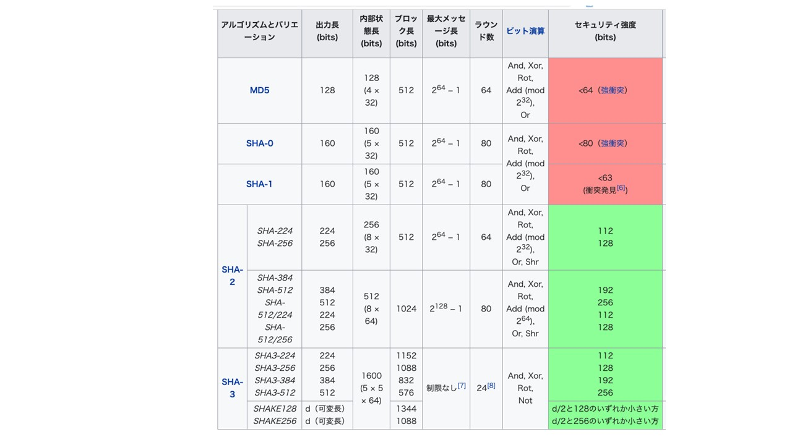

## 3.3 ハッシュ

　ハッシュはメッセージダイジェストとも呼ばれ、不定長の長いメッセージを固定長の短いデータに圧縮するための単方向性のアルゴリズムです。

ハッシュ値を求めるハッシュアルゴリズムには、ハッシュ値から逆にそのようなハッシュ値となるメッセージを得ることが（事実上）不可能であること（原像計算困難性、弱衝突耐性）ことが求められます。そのためには、メッセージをほんの少し変えたときハッシュ値は大幅に変わり、元のメッセージのハッシュ値とは相関がないように見えようなハッシュ値が得られるようなアルゴリズムであることが求められます。また、同じハッシュ値となる、異なる2つのメッセージのペアを求めることが（事実上）不可能であること（強衝突耐性）も求められます。

ハッシュアルゴリズムとして早い時期にRonald RivestによるMD5が1992年にRFC1321として標準化され、その後NISTによる標準としてハッシュビット長がより長く、大きなデータに適用できるSHA1, SHA2が標準化され広く利用されました。SHA1は160ビットのハッシュのアルゴリズムですが、SHA2は224ビットから512ビットまでのハッシュ長を得る一連のアルゴリズムの総称です。SHA2はそのハッシュ長ごとにSHA256, SHA512などとも呼ばれています。

TLSでもこれらをベースとした暗号スイートが標準として採用されてきましたが、近年MD5, SHA1に関する攻撃に関する研究が報告され、攻撃の現実化が懸念されるようになりました。そのため、MD5、SHA1はTLS1.3では完全に廃止されました。

MD5, SHA1、SHA2はMerkle–Damgård constructionアルゴリズムをベースにしており、このアルゴリズムのみへの依存に対する懸念から、新しい標準としてSHA3が制定されました。しかし、現在のところSHA2に関しては具体的なリスクは報告されておらずTLS1.3ではSHA256, SHA384が採用されています。

  

  

表3-2 主なハッシュアルゴリズム（Wikipediaより)

