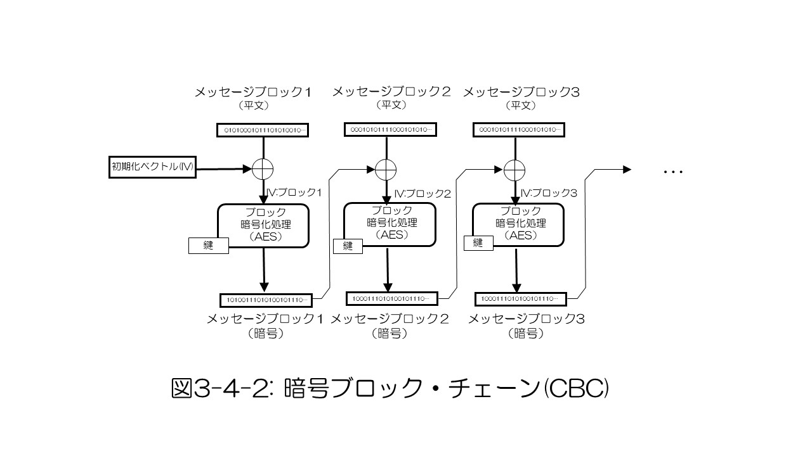
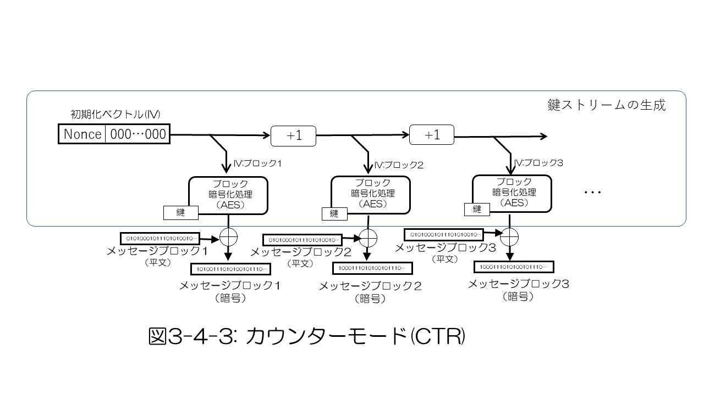
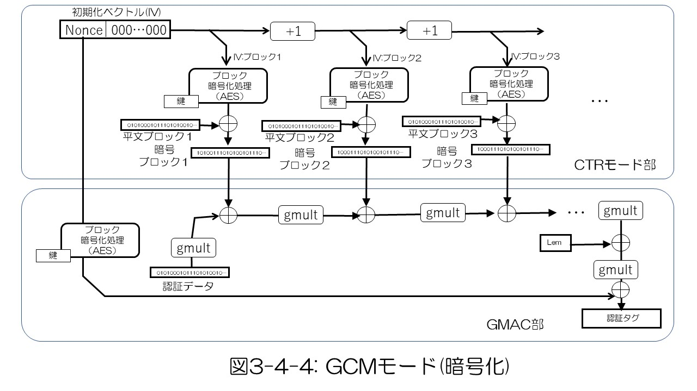

## 3.4 Symmetric key cipher

A cryptographic algorithm that uses the same key for encryption and decryption is called symmetric key cipher. Since it has the characteristic of being able to efficiently encrypt and decrypt large amounts of data, TLS uses it as an encryption algorithm when transferring application data. In order to solve the common key delivery problem, TLS uses public key cryptography to securely share the same key with the other party (key exchange, key agreement) and then process the common key cryptography. ..

There are two types of common key cryptographic algorithms: block type and stream type. The block type divides the basic unit of encryption into blocks, and realizes encryption of each block and chaining it to encrypt the entire message of the desired size. On the other hand, the stream type continuously encrypts the entire processing target without dividing the processing unit.

### 1) Stream cipher

In stream cipher, a random bit array of the same size as the plaintext to be encrypted is generated by a kind of pseudo-random number generation based on a given encryption key of a specific size. This bit array is encrypted by performing an exclusive OR encryption operation for each bit (Fig. 3-4-1). In such an exclusive OR of bit strings, there is no correlation between the frequency of occurrence of 1/0 of the input bit string data and the frequency of occurrence in the output. Therefore, by encrypting with such a structure, it is possible to make it impossible to infer the plaintext from the ciphertext based on the frequency of occurrence of bits as long as the randomness of the key can be ensured.

   

   

Stream ciphers have the great feature that they can be processed by simple algorithms, but their cipher strength depends on the quality of pseudo-random number generation. Early developed by Ronald Rivest, RC4 was widely used in TLS and other protocols, but in recent years, attacks on RC4 have been reported and are no longer used. Meanwhile, the Salsa20, which was subsequently developed and announced by Daniel Bernstein, was upgraded as ChaCha20 (RFC 7539). ChaCha20 realizes authenticated encryption in combination with the message authentication code Poly1305 (see "3) Authenticated encryption"), and is adopted as one of the common key encryption algorithms in the current TLS.

### 2) Block encryption and usage mode

Block-type encryption divides a message into fixed-length blocks and encrypts and decrypts each block. Triple DES, which improved the key length constraint of DES (Data Encryption Standard), which was initially developed as a one-block encryption algorithm, was used as the initial encryption algorithm of TLS. After that, AES (Advanced Encryption Standard) was developed as an algorithm that can be processed more efficiently by computer processing, and those with a block length of 128 bits and a key length of 128, 192, 256 bits were standardized and are widely used until now. ..

In block cipher, multiple blocks are joined together to process the required message size. Various methods have been proposed for connecting blocks. The simplest is called ECB (Electronic Codebook), which uses the same key and IV in all blocks, but this limits the confidentiality of the message. The CBC mode, in which the exclusive OR of the plaintext message of the previous block and the plaintext message of the next block is the IV of the block, can achieve high confidentiality with a relatively simple algorithm, so AES-CBC combined with the AES block cipher. The mode has been widely used in TLS until recently.

   

   

In CTR mode, as shown in Fig. 3-4-2, an appropriate nonce value is given to the upper part as the overall IV, and a binary integer zero is given to the lower part, and this is incremented by 1 for each block, and the variable length key is used as the IV for each block. To generate. The plaintext message is encrypted by taking an exclusive OR with this variable length key. Although a block cipher such as CTR mode AES is used as an element algorithm, it can be said to be a stream cipher because it generates and encrypts a variable-length key in this way.

Although CTR mode is a simple algorithm, it does not impair confidentiality, and since the dependency of each block is only the counter, it is suitable for processing in parallel for each block as long as the block number is known.

   

   

### 3) authenticated encryption with associated data (AEAD)

This type of encryption algorithm does not guarantee that the original plaintext has not been tampered with (message authenticity) just because it was decrypted. For this reason, in TLS, in addition to encryption, a message authentication code (MAC) is assigned to each record to verify its authenticity. However, in recent years, it has been pointed out that this method cannot completely guarantee the authenticity, and in TLS 1.3, only the AEAD method, which can perform message authentication in finer units in combination with encryption processing, has been adopted. Therefore, although CTR mode continues to be used as a base mechanism for realizing authenticated encryption described below, standalone CBC mode and CTR mode are excluded from the standard.

Authenticated encryption is a cryptographic algorithm that checks the authenticity of a message at the same time as encrypting and decrypting the message. An authentication tag used for authenticity check is generated at the same time as the message encryption process, and the authenticity is checked by the authentication tag during the decryption process. Authenticated encryption used in TLS 1.3 includes block type AES-GCM (Galois / Counter Mode), AES-CCM (Counter with CBC-MAC) and AES-CCM_8, and stream type ChaCha20-Poly1305. ..

In AES-GCM, AES-CTR is used for the encryption processing unit, authentication tag is generated, and GMAC (Galois Message Authentication Code) is used for authentication to realize authentication with authentication tag. Figure 3-4-3 shows the flow of the algorithm for encryption processing. The GMAC processing unit takes the authentication data value as input and derives the authentication tag value from the encrypted message. This authentication tag value is used to check the authenticity as input for the decryption process.

   

   

AES-CCM and AES-CCM_8 also use AES-CTR for the encryption part, but use CBC-MAC for the authentication tag. Since CBC-MAC is lighter in processing than GCM's GMAC, these usage modes are used for embedded systems with relatively low processor processing power.

Table 3-4-1 summarizes the main TLS common key cryptosystems, including those that are obsolete.

[Table 3-4-1 Main common key cryptography of TLS](./table3-4-1.md)