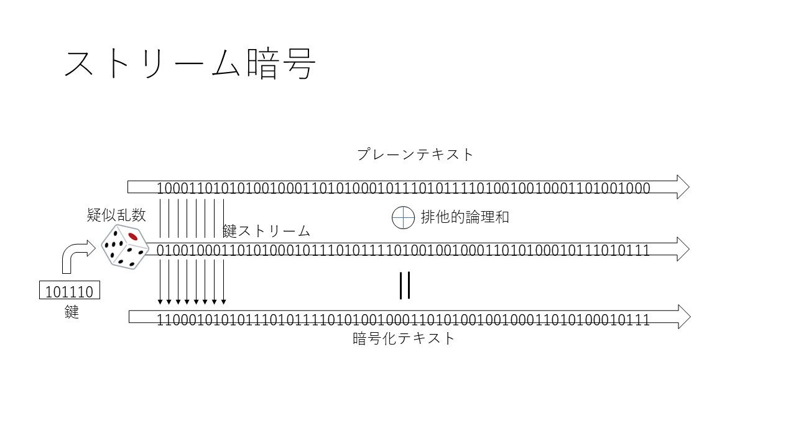
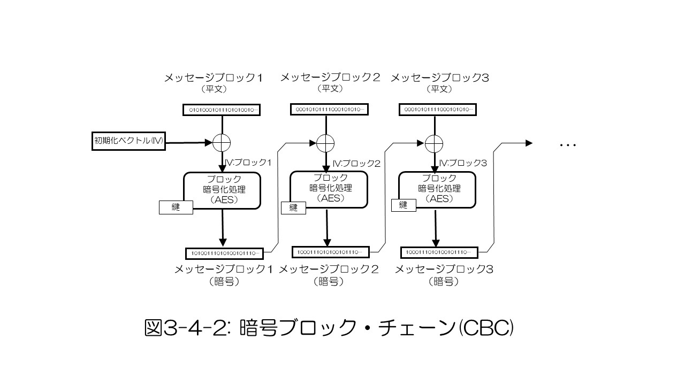
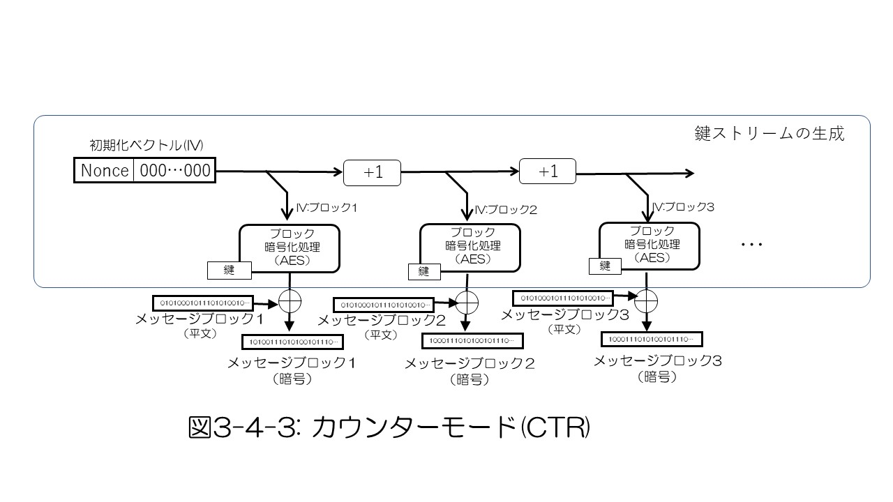
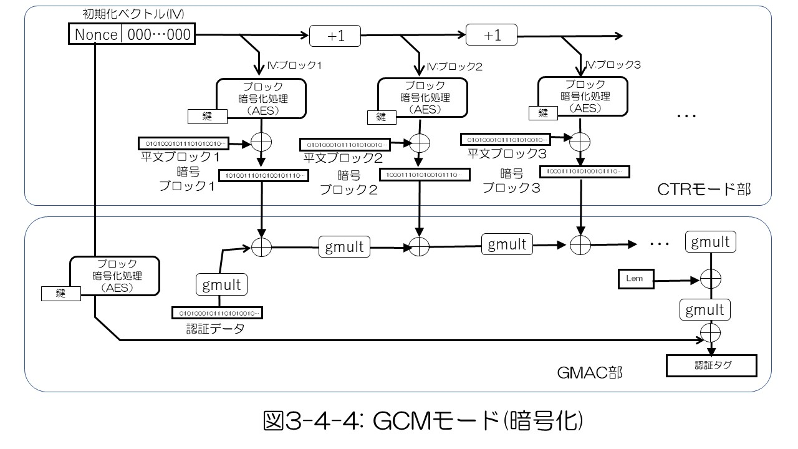
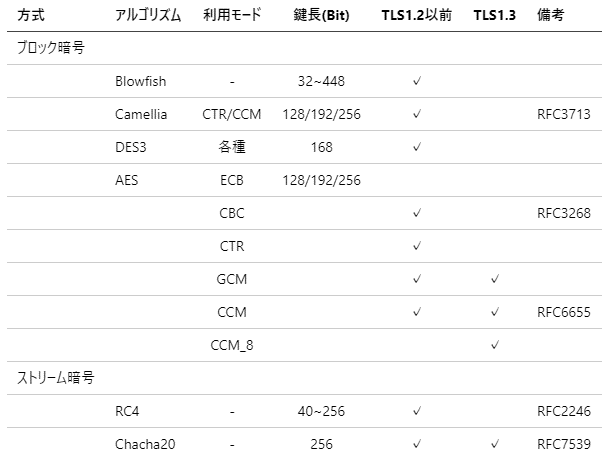

## 3.4 共通鍵暗号

　暗号化と復号化に同じ鍵を使用する暗号アルゴリズムを共通鍵暗号（対称鍵暗号）と呼びます。共通鍵暗号は大容量のデータを効率的に暗号化、復号化できる特徴があるので、TLSではアプリケーションデータ転送時の暗号アルゴリズムとして使用します。共通鍵の配送問題を解決するために、TLSでは公開鍵暗号の技術を使って通信の相手方と安全に同一の鍵を共有した上で（鍵交換、鍵合意）共通鍵暗号の処理を行います。

共通鍵暗号のアルゴリズムにはブロック型とストリーム型の二つの方式があります。ブロック型は暗号化の基本単位をブロックに分け、ブロック単位の暗号化とそれをチェーンして目的のサイズのメッセージ全体の暗号化を実現します。これに対してストリーム型は、処理の単位をわけずに処理対象全体を連続的に暗号化します。

### 1) ストリーム型暗号

ストリーム暗号では、与えられた特定サイズの暗号鍵を基に一種の疑似乱数生成によって暗号化しようとする平文と同じサイズのランダムなビット配列を生成します。このビット配列に対して、ビットごとに排他的論理和による暗号化演算を施すことによって暗号化を行います(図3-4-1)。このようなビット列の排他的論理和では入力となるビット列データの1/0の出現頻度と出力における出現頻度に相関関係がありません。そのためこのような構造で暗号化することで、鍵のランダム性さえ確保できればビットの出現頻度をもとに暗号文から平文を推測することを不可能とすることができます。

  

  

ストリーム暗号は単純なアルゴリズムで処理を実現できるという大きな特徴を持っていますが、その暗号強度は疑似乱数生成の質の如何にかかっています。ロナルド・リベストにより初期に開発されたRC4はTLSやその他のプロトコルにおいて広く使用されていましたが、近年、RC4に対する攻撃法が報告されるに至り、現在では使用されなくなっています。一方、その後ダニエル・バーンスタインによって開発発表されたSalsa20はChaCha20(RFC 7539)として改良されました。ChaCha20はメッセージ認証符号Poly1305との組み合わせて認証付き暗号を実現し( 「3) 認証付き暗号」参照)、現在のTLSで共通鍵暗号アルゴリズムの一つとして採用されています。

### 2) ブロック型暗号と利用モード

ブロック型暗号は、メッセージを固定長のブロックにわけてブロックごとに暗号化、復号化の処理をします。１ブロックの暗号化アルゴリズムとして初期に開発されたDES(Data Encryption Standard)の鍵長の制約を改善したトリプルDESはTLSの初期の暗号アルゴリズムとして使用されました。その後、コンピュータ処理でより効率的に処理できるアルゴリズムとしてAES(Advanced Encryption Standard)が開発され、ブロック長さ128ビット、鍵長128, 192, 256ビットのものが標準化され、現在まで広く使われています。

ブロック暗号では、必要なメッセージサイズの処理をするためにブロックを複数つなぎ合わせて処理をします。ブロックをつなぐ方式についてもさまざまな方式が提案されています。最も単純なものはECB(Electronic Codebook)と呼ばれ、すべてのブロックで同じ鍵とIVを使用しますが、これではメッセージの秘匿性に限界があります。前のブロックの暗号メッセージと次のブロックの平文メッセージの排他的論理和をブロックのIVとするCBCモードは比較的簡単なアルゴリズムで高い秘匿性を実現できるので、AESブロック暗号と組み合わせたAES-CBCモードは最近までTLSで広く使われてきたました。

  

  

CTRモードは図3-4-2のように、全体のIVとして上位に適切なnonce値、下位をバイナリ整数ゼロを与え、ブロックごとにこれを1ずつインクリメントさせブロックごとのIVとして可変長の鍵を生成します。平文メッセージをこの可変長の鍵と排他的論理和をとることで暗号化します。CTRモードAESのようなブロック暗号を要素アルゴリズムとしていますが、このような形で可変長の鍵を生成し暗号化するので実質的にストリーム暗号とも言えます。

CTRモードは簡単なアルゴリズムでありながらす秘匿性をそこなわず、またブロックごとの依存性はカウンターだけなのでブロック番号さえわかればブロックごとに並列に処理に適しているという特徴ももっています。

  

  

### 3) 認証付き暗号(AEAD: authenticated encryption with associated data)

この種の暗号化アルゴリズムでは、復号化ができたからと言ってもとの平文が改ざんされていないこと(メッセージの真正性)の保証にはなりません。このためTLSでは、暗号化とは別にレコード毎にメッセージ認証コード(MAC: Message Authentication Code) を付与して真性性の検証をしていました。しかし、近年この方法では真正性を完全に保証できないリスクが指摘され、TLS1.3では暗号化処理と組み合わせてより細かな単位でメッセージ認証ができるAEAD方式のみが採用されることになりました。そのため、CTRモードは次に説明する認証付き暗号を実現するためのベースの仕組みとして利用が継続されているものの、単体のCBCモード、CTRモードは標準から除外されています。

認証付き暗号はメッセージの暗号化、復号化と同時にメッセージの真正性の確認も行う暗号アルゴリズムです。真正性のチェックに使用する認証タグをメッセージの暗号化処理と同時に生成し、復号化処理の際にその認証タグによって真正性をチェックします。TLS1.3で使用されている認証付き暗号としては、ブロック型のAES-GCM(Galois/Counter Mode), AES-CCM(Counter with CBC-MAC)およびAES-CCM_8、ストリーム型のChaCha20-Poly1305があります。

AES-GCMでは、暗号処理部にAES-CTR、認証タグの生成、認証にGMAC(Galois Message Authentication Code)を使用して認証タグ付き暗号を実現しています。図3-4-3に暗号化処理の場合のアルゴリズムの流れを示します。GMAC処理部は認証データ値を入力として、暗号化されたメッセージから認証タグ値を導きます。この認証タグ値は復号化処理の入力として真正性のチェックに使用されます。

  

  

AES-CCM、AES-CCM_8も暗号化部分には同じくAES-CTRを使用しますが、認証タグはCBC-MACを使用します。CBC-MACはGCMのGMACより処理が軽いため、これらの利用モードは比較的プロセッサの処理能力の低い組込みシステム向けなどに利用されています。

表3-4-1 に廃止となったものを含めてTLSの主な共通鍵暗号をまとめます。

  
 
 [表3-4-1 TLSの主な共通鍵暗号](./table3-4-1.md)
  

