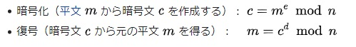
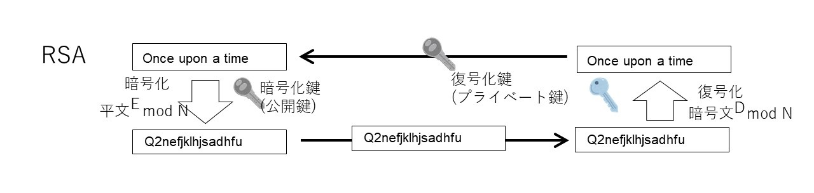
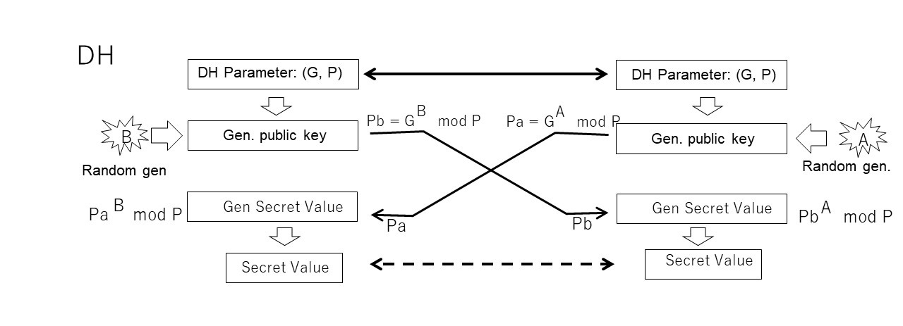
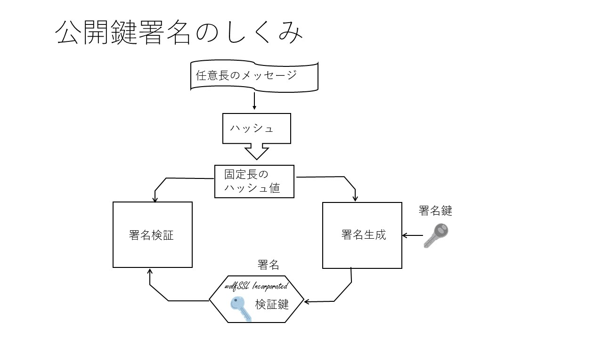
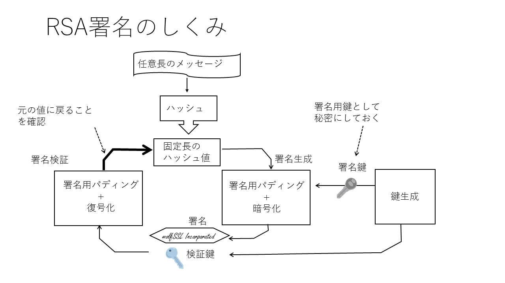
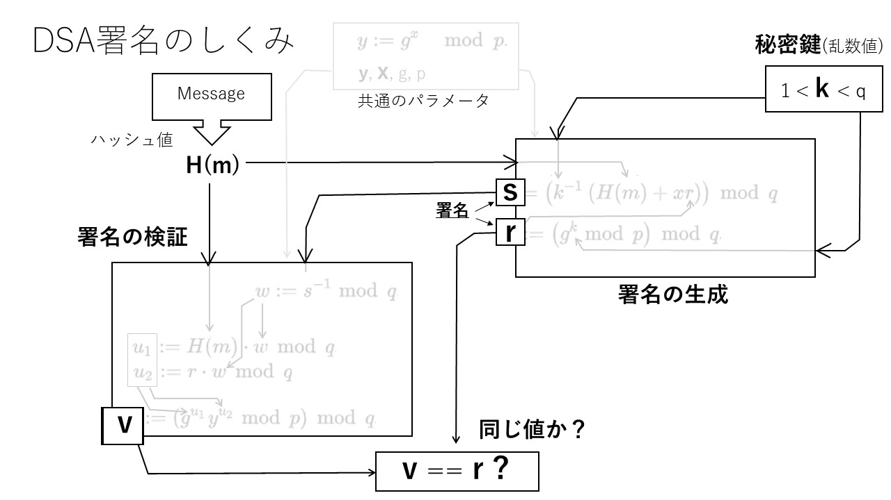

## 3.6 Public-key cryptography and key sharing

### 3.7.1 Background
Public-key cryptography is a cryptographic method that allows a public key by a pair of different keys for encryption and decryption. However, today, public key technology is applied in various aspects, not limited to encrypting data. In TLS, it is used as a key exchange or key sharing for solving the key delivery problem of a symmetric key, a digital signature (public key signature) and extended to a public key certificate. 

RSA cryptography is a public key cryptography invented by Ronald Rivest, Adi Shamir, and Leonard Adleman, and is a cryptography that realizes confidentiality based on the difficulty of discrete logarithmic operations. Furthermore, at this time, if an appropriate set of prime numbers (e, d, n) is selected, the encrypted message c can be obtained by multiplying the plaintext message m to the e-th power and taking the remainder modulo n as shown below. , C is raised to the dth power, and the remainder is taken in the same way to obtain the original decrypted message m. In RSA cryptography, integer values ​​e and n are used as the key for encryption and d and n are used as the private key for decryption by using the set of numerical values ​​that satisfy these conditions.

The exponential remainder operation used in RSA is a unidirectional operation that is extremely difficult if the numerical value is sufficiently large, so the discrete logarithmic operation, which is an inverse operation, keeps the encrypted information secret even if the encryption key is disclosed. can. In addition, it is possible to decrypt with a key different from encryption because there is a circular operation that can return to the original numerical value by selecting an appropriate numerical pair.

### 3.7.2 RSA Practical Technology

#### 1) Practical modulo operation
RSA will handle huge integers in the process of calculation if the operation is based on this principle. However, algorithms for reducing this are also known. For example, by using the reduction method based on the Chinese Remainder Theorem or Montgomery reduction, such a calculation becomes possible if there is an area twice the key size. I will.

#### 2) Probable prime
Larger prime numbers must be used to make inverse operations difficult with algorithms like RSA, but simple prime number generation algorithms take an extremely long time to find large prime numbers. Therefore, many practical cryptographic software employs a probable primality test. Established primality tests allow numbers that are not prime numbers with a certain probability, but if the probability is low enough, it is possible to prevent the confidentiality of cryptography from being impaired in practice.

#### 3) Padding
With RSA encryption, public key cryptography is not guaranteed to be the correct composite key just because it can be decrypted. In addition, there is no guarantee that the decrypted message has not been tampered with and that it is correct (authenticity guarantee). Practical RSA cryptography involves inserting an additional padding bit string into the original message and verifying it.

For this reason, PKCS # 1 v1.5, which is the standard for RSA cryptography, also defines the standard for the padding algorithm. After that, as a more improved method, Optimal asymmetric encryption padding (OAEP) for encryption and decryption, and probabilistic signature scheme for padding when RSA is used for public key signature. (PSS: Probabilistic signature scheme) is standardized.

### 3.7.3 Initial key exchange

Public-key cryptography by RSA was widely used as a key exchange protocol to solve the key delivery problem of symmetric-key cryptography in the early days of TLS (Fig. 3-6-1). First, the recipient who wants to receive the encrypted message sends the public key to the sender as an encryption key. The sender of the message encrypts the sent message with the received public key and sends it to the receiver. In the case of TLS, it sends the premaster secret that is the source of the key used to conceal application messages by symmetric key cryptography. The recipient uses the private key to decrypt it.

   

   

Considering the TLS usage scenario, it is also necessary to perform server authentication to prevent server spoofing. If you send the server certificate for server authentication instead of sending a single public key when sending the above public key, it is convenient because the public key contained in it can be used as it is. Initially, such usage was standardized in the early days of TLS.

However, security risks have changed with the times, and the risk of continuing to use the same public key for a long period of time (static public key) has been pointed out (Chapter 5 Security, Vulnerability: Complete forward secrecy). reference). To avoid this risk, key pairs need to be updated frequently, but for certificates, it is not practical to update the certificate authority's signature frequently.

In the meantime, the progress of cryptographic algorithms has been remarkable, and the demand for selecting algorithms to be used for key exchange and certificate algorithms based on independent selection criteria has increased, and the sending of certificates and keys for server authentication have become stronger. There is a growing awareness that the exchange protocols should be independent.

Against this background, in the TLS 1.2 era, RSA static public key key exchange was no longer recommended and was abolished in TLS 1.3, and RSA public key algorithms are for certificates (see Chapter 9 Public Key Certificates). ) Is now limited.

### 3.7.4 Diffie-Hellman Key Exchange

Around the same time as RSA, another public key algorithm, Diffie–Hellman key exchange (DH), was invented. DH cannot decrypt encrypted data like RSA, but it can get a common value between the two trying to communicate. By using this for key exchange (key agreement), the key distribution problem can be solved (Fig. 3-6-2).

Unlike RSA, DH takes advantage of the unidirectionality of discrete logarithmic operations as well as the commutativity of the order of two operations. Specifically, the key exchange is realized by the following procedure.

First, both parties trying to obtain a common key value first share a set of prime numbers (DH parameters), which are common parameters. This parameter is a value that can be disclosed to a third party.

   

   

In order to exchange keys, both parties generate a secret random number value (secret key) for the other party and a third party, respectively. For this value, use the DH parameter above to find the remainder of the exponentiation, and give that value to the other party. Since this is a unidirectional operation where it is difficult to know the original value from the encrypted value like the above-mentioned RSA public key encryption, it can be passed to the other party as a public value (DH public key). ..

The recipient uses this value, his private key, and the DH parameter to find the final shared key value. Comparing the contents of both operations, you can see that the operation structure is the same, only the order of operations is different.

Since it can be proved separately that the remainder operation of this two-step power is commutative, it can be guaranteed that the common value can be obtained by this algorithm regardless of the value of both private keys. TLS uses this value as the premaster secret (the original value for the key, IV, etc. used in subsequent common key cryptography).

The method of sending these parameter values ​​and public keys in the TLS handshake usage scenario is slightly different between TLS 1.2 and TLS 1.3.

Until TLS1.2, ClientHello and ServerHello were limited to agreement on the cipher suite to use, and the DH parameters and DH public key actually used by DH were sent by the second round trip ClientKeyExchange and ServerKeyExchange.

In TLS 1.3, handshakes are organized, DH parameters and public keys are stored in the KeyShare extension of ClientHello and ServerHello, the server uses the contents received by ClientHello, and the client uses the contents received by ServerHello and its own private key. You can now get a premaster secret and derive the session key from it (see ?? Chapter: Key Derivation). This makes it possible to complete the handshake in one round trip with TLS 1.3, and it is also possible to encrypt the contents from the middle of the handshake.

#### Ephemeral Key

### 3.7.5 Digital signature

Digital signatures (public key signatures) are used to verify the authenticity of a message. In addition, since a digital signature signature cannot generate a legitimate signature other than the legitimate signer, it can be used to confirm the signer and, conversely, to prevent denial that the signature was generated.

If you only want to verify the correspondence between the message and the signature, you can use the message authentication code (MAC) with a common key. However, MAC allows a signature verifier who knows the key to generate a legitimate signature, so it cannot be used to confirm the legitimate signer or prevent signature denial.

When signing with a public key, the signature generation key and the verification key are different, so only those with a private key can sign. Therefore, by checking the validity of the signature, it can be confirmed that the signature is by a legitimate signer. It can also be used for the purpose of preventing denial of signing.

Figure 3-6-3 shows the structure of a digital signature. Digital signatures first find a fixed-length hash value for the target message so that you can sign a message of arbitrary length. Signature generation uses this hash value and some secret value (signature key) known only to the signer to generate the signature. Signature verification, on the other hand, verifies the validity of the signature based on the hash value, the signature and the key for signature verification.
 

 

### 1) RSA signature

In RSA signature, signature generation and verification are realized by using the fact that what is encrypted by RSA operation returns to the original by decryption (cyclic group). The signature is generated from the hash value of the message using the key equivalent to the public key in the RSA encryption algorithm and the algorithm equivalent to encryption.

On the other hand, signature verification uses the hash value of the message, the signature, and the key for signature verification. The verification key corresponds to the private key for decryption during encryption. If the signature verification key yields the original hash value, then the message and signature have been validated.

 
With RSA signing, the signing key is kept secret only by the signer, and the verification key is disclosed for verification. In principle, it can be realized by using the same algorithm as RSA encryption and decryption by using it in the opposite way to public and private for encryption and decryption.

However, unlike today's practical RSA signature algorithms that include padding, which are standardized for decryption, they cannot be diverted to each other. To avoid confusion in this document, we will not use the names of encryption and decryption as the digital signature algorithm, but will call them the signature and verification algorithms. In addition, the names of public and private keys are confusing as words that express their uses, so we will call them signature keys and verification keys.
 

### 2) DSA signature

DSA (Digital Signature Algorithm) signatures utilize the fact that the same value can be obtained between two different combinations of unidirectional operations, rather than using a cyclic group like RSA. One of the features is that it does not require tampering prevention using padding because it does not use a cyclic group.

However, it is difficult to generate a proper key for DSA, and it is necessary to be careful. In addition, it is necessary to generate a new key for each signature so that the key cannot be decrypted. For this reason, RSA signatures are more widely used in the world of integer arithmetic. However, since no cyclic group has been found in elliptic curve cryptography, ECDSA and EdDSA (explained in the ECC chapter), which have realized an algorithm equivalent to DSA in the world of integer arithmetic in the world of elliptic curve cryptography, are widely used.

Figure 3-6-5 shows the flow of DSA signature and verification. From the viewpoint of security strength, it is important to generate a key to obtain an appropriate key in DSA signature, but here we will only explain the flow of signing and verification using the generated key to understand the principle of DSA. I will squeeze.

Apart from the detailed algorithms, let's look at the connection between the signature generation and verification boxes. The two boxes on the right side of the figure are the signature generation, and the left side is the verification part. The message shall have a fixed length value with the appropriate hash function H (m).

In the signature generation, it can be seen that the signature values ​​r and s are obtained by inputting the hash value H (m) and the random number value k generated as the signature key. Of these, the value r is the remainder of the power to be obtained from the signature key k and the common parameters, and is similar to the unidirectional operation used in RSA and DH. Since it is a unidirectional operation, the confidentiality of the key k can be maintained even if this value is disclosed as the signature value.

The other value s is obtained from the key k and the hash value H (m), but is taken over by the signature verification flow and is part of another unidirectional operation flow.

In the verification, the value v for verification is obtained by inputting this value s and the hash value. The operation of the value v is such that the value of H (m) is erased during the calculation, and if the signature is correct regardless of H (m), the resulting value can be obtained on the signature generation side. It will be the same value as the existing value r.

However, as you can see in the figure, H (m) is used in both the signature generation side and the verification side operations. Therefore, the value s, which is the result of the operation, and the process of calculating the value v based on the value of s also depend on H (m), and H (m) is integrated in both signature generation and verification. If is not given, the correct value v cannot be obtained. In other words, if H (m) is different between the two, the verification will fail.

DSA uses this arithmetic structure to verify the signature of a specific message.

 

 

### 3.7.6 Standards for public key cryptography

#### 1) PKCS # 1: RSA cryptography
The standard rules for basic RSA encryption were initially established as PKCS # 1, but now this content has been taken over by the IETF RFC. The latest PKCS # 1 V2.2 (RSA Cryptography Specifications Version 2.2) as of 2021 is defined as RFC 8017 and includes provisions such as cryptography, decryption, signing and verification methods (primitives and schemes). I am.

[Table 3-6-1](./Algorithm-table3-6-1-jp.md)

[Table 3-6-2](./Algorithm-table3-6-2-jp.md)