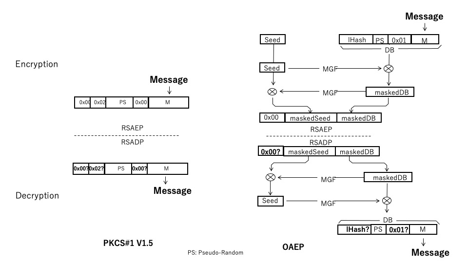

## 3.6 公開鍵暗号と鍵共有

### 3.6.1 背景
公開鍵暗号は、当初は暗号化と復号化に異なる鍵を使うことから片方の鍵を公開できるようにした暗号方式として研究されました。しかし今日、公開鍵のもつ性質はさまざまな局面で応用され、その適用分野は多岐にわたっています。当初の情報秘匿のための暗号化、復号化を目的とした利用方法はむしろ主要の目的とは言えない状況となりつつあります。

TLSの中でも、公開鍵暗号の技術は主に共通鍵の鍵配送問題の解決のための鍵交換ないし鍵共有、あるいは公開鍵署名とそれをベースにした証明書として使用されています。本章では、公開鍵の基本的な考え方とそれを利用した鍵交換、デジタル署名を中心に説明します。証明書については、3.8 公開鍵証明書 で説明します。

RSA暗号はロナルド・リベスト、アディ・シャミア、レオナルド・エーデルマンにより発明された代表的な公開鍵暗号で、離散対数演算の困難性に基づいて秘匿性を実現した暗号方式です。さらにこのとき、適切な素数の組(e, d, n)を選ぶと、下のように平文メッセージmをe乗しnで割ったあまりが暗号化メッセージcとなり、cをd乗し同様に剰余をとることでもとの復号化メッセージmを得ることができます。RSA暗号では、このような条件の成立する数値の組を利用して、整数値e, nを暗号化のための鍵、d, nを復号化のための秘密鍵として使います。

RSAで使用している指数の剰余演算の逆演算は離散対数演算です。この離散対数演算は数値が十分に大きな素数であれば演算が極めて困難で簡単な計算方法は見つかっていません。つまり、指数の剰余演算は実質的に一方向のみ可能な演算なので、暗号化の鍵は公開しても暗号化した情報を秘匿することができます。また、適切な数値ペアを選ぶことで元の数値に戻すことができる循環演算が存在することで暗号化と異なる鍵で復号化することが可能となります。


### 3.6.2 RSAの実用化技術

#### 1) 実用的な剰余演算
この原理のままでは計算途上で巨大な整数を扱うことになり、実用的ではありません。これを削減するためのアルゴリズムも知られていて、それらを利用することで鍵サイズの２倍の領域があればこのような計算が可能となります。例えば、中国の剰余定理に基づく削減方法やモンゴメリ削減などがあります。wolfSSLライブラリーではモンゴメリー削減を使用しています。

#### 2) 確率的素数
RSAのようなアルゴリズムで逆演算を困難とするためには大きな素数を使用する必要がありますが、単純な素数生成アルゴリズムでは大きな素数を見つけるには長い処理時間がかかってしまいます。そのため実用的な暗号ソフトウェアの多くでは確率的素数判定法が取り入れられています。確率的素数判定では一定の確率で素数でなない数値を許してしまいますが、その確率が十分に低いことで実用上暗号の秘匿性をそこなわないようにすることができます。

#### 3) パディング
公開鍵暗号は復号ができたからと言って、そもそも対象メッセージが改ざんされたものでないこと、正しいものである保証（真正性の保証）はありません。もとのメッセージに付加的なパディングを挿入することでこれを検証する方法が開発されています。RSAにおけるパディングのために基本的な暗号アルゴリズムを組み合わせたパディングスキームについては、当初RSA社によりPKCS#1にて定義されましたが、現在はIETFに引き継がれRFC8017の中で規定されています(詳細は3.6.6 公開鍵暗号に関する標準を参照)。

### 3.6.3 RSAによる初期の鍵交換

RSAによる公開鍵暗号はTLSの初期には共通鍵暗号の鍵配送問題を解決するための鍵交換プロトコルとして広く利用されました(図3-6-1)。まず、暗号化メッセージを受け取りたい受信側は送信側に対して公開鍵を暗号化用の鍵として送付します。メッセージの送信側は受け取った公開鍵で送信メッセージを暗号化し受信側に送ります。TLSの場合、その後の共通鍵暗号によるアプリケーションメッセージの秘匿化に使用する鍵の元となるプレマスターシークレットを送ります。受け取った側はプライベート鍵のほうを利用してこれを復号化します。

<br><br>

<br><br>

TLSの利用シナリオを考えると、サーバの成りすましを防止するためのサーバ認証も行う必要があります。当初は、上記の公開鍵の送付の際に単体の公開鍵を送るのではなくサーバ認証のためのサーバ証明書を送るようにすればその中に含まれている公開鍵がそのまま利用できるので好都合であると考えられ、TLSの初期にはそのような利用方法が標準化されました。

しかし、時代とともにセキュリティリスクも変化し、同じ公開鍵を長期に使い続けること(静的公開鍵)のリスクが指摘されるようになってきました(五章　安全性、脆弱性：完全前方秘匿性参照)。このリスクを回避するためには鍵ペアを頻繁に更新する必要がありますが、証明書の場合、認証局の署名を頻繁に更新するのは現実的ではありません。

またその間、暗号アルゴリズムの進歩も著しく、鍵交換に利用するアルゴリズムの選択と証明書のアルゴリズムは独立の選択基準で選択したいという要求も強くなってきて、サーバ認証のための証明書の送付と鍵交換のためのプロトコルは独立させたほうがよいという認識が強くなりました。

そのような背景で、TLS1.2の時代にはRSAの静的公開鍵による鍵交換は推奨されなくなりTLS1.3では廃止され、RSAによる公開鍵アルゴリズムは証明書用(八章 公開鍵証明書参照)に限定されるようになりました。

### 3.6.4 ディフィーヘルマン鍵交換

RSAとほぼ同時期にもう一つの公開鍵アルゴリズム、ディフィーヘルマン鍵交換(DH: Diffie–Hellman key exchange)が発明されました。DHは、RSAのように暗号化したデータを復号化するようなことはできませんが通信しようとする2者の間で共通の値を得ることができます。これを鍵交換（鍵合意)に利用することで、鍵配送問題を解決することができます(図3-6-2)。

DHでは、RSAとは異なり離散対数演算の一方向性とともに二回の演算の順序の可換性を利用します。具体的には、次のような手順で鍵交換を実現します。

まず、共通の鍵値を得ようとする両者は、はじめに共通のパラメータである一組の素数(DHパラメータ)を共有しておきます。このパラメータは第三者に公開することができる値です。

<br><br>

<br><br>

鍵を交換するために、両者はそれぞれ相手や第三者に対して秘密の乱数値(秘密鍵)を生成します。この値に対して先ほどのDHパラメータを使ってべき乗の剰余を求め、その値を相手側にわたします。これは前述のRSAの公開鍵による暗号化と同様に暗号化した値からもとの値を知ることは困難な一方向演算なので、公開の値(DH公開鍵)として相手方に渡すことができます。

受け取った側では、この値と自分の秘密鍵、DHパラメータを使い最終的な共有鍵の値を求めます。両者の演算内容を比べてみると、単に演算の順序が異なるだけで演算の構造は同じとなっていることがわかります。

この二段階のべき乗の剰余演算が可換であることは別途証明できるので、両者の秘密鍵がどのような値であってこのアルゴリズムによって共通の値を得ることが保証できます。TLSではこの値をプレマスターシークレット（その後の共通鍵暗号で使用する鍵、IVなどを求める元の値）として使用します。

TLSハンドシェークの利用シナリオにおけるこれらのパラメータ値や公開鍵の送付方法はTLS1.2までとTLS1.3ではやや異なります。

TLS1.2までは、ClientHelloとServerHelloは使用する暗号スイートの合意のために限定され、実際にDHで使用するDHパラメータやDH公開鍵は２往復目のClientKeyExchangeとServerKeyExchangeによって送られていました。

TLS1.3ではハンドシェークが整理され、DHパラメータや公開鍵はClientHelloとServerHelloのKeyShare拡張に格納されるようになり、サーバはClientHelloの受信内容、クライアントはServerHelloの受信内容と自分の秘密鍵を使ってプレマスターシークレットを得て、そこからセッション鍵を導出(3.5：鍵導出参照)できるようになりました。これによってTLS1.3ではハンドシェークを１往復で完了することができるようになったのとともに、ハンドシェークの途中から内容を暗号化することも可能となりました。

### 3.6.5 デジタル署名

デジタル署名（公開鍵署名）は、メッセージの正当性の確認のために使用します。また、デジタル署名の署名は正当な署名者以外は正当な署名が生成できないので、署名者の確認、逆に署名を生成したことの否認防止のためにも使用できます。

メッセージと署名の対応関係の検証だけであれば共通鍵によるメッセージ認証コード(MAC)でも可能です。しかし、MACでは鍵を知っている署名の検証者自身も正当な署名を生成することができてしまうので、正当な署名者の確認や署名否認の防止のためには利用できません。

公開鍵による署名では、署名生成鍵と検証鍵が異なるので秘密鍵を持ったものだけが署名可能です。そのため、署名の正当性を確認することでその署名が正当な署名者によるものであること確認することができます。また、逆に署名したことの否認防止の目的にも利用することができます。

図3-6-3にデジタル署名の構造を示します。デジタル署名では、任意長のメッセージに署名することできるように、まず対象メッセージの固定長のハッシュ値をもとめます。署名の生成では、このハッシュ値と署名者だけが知る何等かの秘密の値（署名鍵）を使用して署名を生成します。一方署名の検証では、ハッシュ値、署名と署名検証用の鍵をもとに署名の正当性を検証します。
<br>


<br>

### 1) RSA署名

RSA署名では、RSA演算によって暗号化したものが復号化でもとに戻ること（巡回群）を利用して署名の生成、検証を実現します。署名の生成はRSA暗号化のアルゴリズムの際の公開鍵に相当する鍵と暗号化に相当するアルゴリズムを使って、メッセージのハッシュ値から署名を生成します。

一方署名の検証は、メッセージのハッシュ値と署名、署名検証用の鍵を利用します。検証用の鍵は暗号化の際の復号用のプライベート鍵に相当します。署名検証鍵によって元のハッシュ値が得られれば、メッセージと署名は正当なものであることが検証できたことになります。


<br>
RSA署名では、署名用の鍵は署名者だけの秘密とし、検証用の鍵は検証用として公開します。暗号、復号の際とは公開、非公開としては逆の使い方をすることで、原理的にはRSA暗号、復号と同様のアルゴリズムを使用して実現することができます。しかし、今日の実用的なRSA署名として標準化されている署名スキームでは、パディングスキームは暗号復号用のものとは異なり、互いに流用することはできません。
<br>
<br>
<br>

### 2) DSA署名

RSA署名では巡回群を使ってメッセージのハッシュをエンコーディングして署名を生成し、検証の際はそれを逆にデコードして確認する、という方法がとられていますが、SA(Digital Signature Algorithm)署名ではそのような巡回群は利用しません。DSAでは、二つの異なる一方向演算の組み合わせ同士で同一の値を得ることができることを利用します。以下、DSAの原理について少し説明します。

一旦、署名と言うことからは離れ、図のようにAとBに同じ入力値を与えるとAもBも同じ結果になるような関数の組み合わせを考えます。

<br>


<br>


簡単のため「一方向関数」という条件もはずすなら、例えば、多項式の展開のような組み合わせが考えられます。どんな入力xが与えられても下の関数AとBの答は当然同じになります。


```math
関数A: (x + 1)^{2}
```

```math
関数B: x^2 + 2x + 1
```

次にこれを少し進めて、二つ目の図のように関数CとDの二段階と、関数CとDにはもう一つの入力「入力2」も受け取るような関数とします。このような関数の組み合わせで先程と同様に関数Cと関数Eに同じ入力1を、そして関数CとDに同じ入力2を加えると関数DとEが同じ結果となるような関数を作り出します。

<br>


<br>


再び、簡単のため「一方向関数」という条件をはずして考えます。入力1をx、入力2をyとすれば、例えば次のような関数が考えられます。

```math
関数C: x + y、 関数D:(x - y)^{2}
```

```math
関数E: x^2
```

つまり、関数CとDの中に入力２を打ち消すような演算を入れておけばいいということがわかります。関数cで足されたyは関数Dで引かれるので、値は当然もとにもどります。

前の図ではC、Dとも同じ入力2が与えられていましたが、次の図のようにもし仮にC,Dの入力2に異なる値が与えられた場合はうまく打ち消しあわないことになります。関数Dと関数Eの結果は当然違う値になるはずです。


<br>


<br>

これを署名検証の流れに当てはめてみます。前の図の入力1は署名のための鍵です。入力２は署名対象のメッセージのハッシュ値です。DSAでは署名は署名値sと検証値rの二つの値の組み合わせとなります。関数Cの結果が署名値s、関数Eの結果が検証値rです。このよう当てはめると下の図のようになって、図の右半分が署名、左半分が検証の流れとなっていることがわかります。

署名側と検証側でH(m)が同じ値ならば、検証値vとrは同じ値となります。

<br>


<br>


もし、例えばメッセージが改ざんされていて検証側のH(m)が署名側と異なれば検証値は一致しません。これで、署名の正当性が検証できたことになります。

<br>


<br>


最後に、この図にDSAの実際の演算式を当てはめてみると下の図のようになります。

<br>


<br>

一方向演算を実現するためのパラメータとしてユーザ鍵ペアが加えられていたり、署名値rも検証演算に加えられていたり詳細の追加はありますが、基本的な構造は前の図と変わらないことがわかります。数学的厳密な意味は別として、随所に整数による公開鍵演算のプリミティブである冪乗の剰余が使われ一方向性が実現されていることを直感的に感ることができるかと思います(modは剰余を表します)。

DSAでは、このような形の巡回群の性質を利用しない演算構造で署名、検証を実現しています。


DSAは実現においては適切な鍵生成が難しく十分な注意が必要です。鍵を解読されないためには署名毎に新しい異なる鍵を生成する必要があります。また、検証のための計算量はRSAくらべてかなり大きくなる傾向にあります。そうした理由で、整数演算の世界においてはRSA署名のほうが広く利用されています。

しかし、楕円曲線暗号では巡回群は見つかっていないため、RSAのような方法で署名検証を実現することはできません。整数演算の世界のDSAと等価のアルゴリズムを楕円曲線暗号の世界で実現したECDSA, EdDSAなどが広く使われています。


### 3.6.6 公開鍵暗号に関する標準

#### 1) PKCS #1: RSA暗号
　基本的なRSA暗号に関する標準規定は当初PKCS #1として制定されましたが、現在ではこの内容はIETFのRFCに引き継がれています。2021年時点での最新であるPKCS #1 V2.2 (RSA Cryptography Specifications Version 2.2)はRFC 8017として定義されていて、暗号、復号、署名と検証の方法（プリミティブとスキーム）などの規定が含まれています。

[Table 3-6-1](./Algorithm-table3-6-1-jp.md)

この標準規定の中には、RSAのためのパディングスキームについても規定されています。当初、PKCS#1 v1.5として比較的単純なスキームが規定されましたが、その後より改善された方式として、暗号復号化には最適非対称暗号パディング(OAEP: Optimal asymmetric encryption padding)、また、RSAを公開鍵署名のために利用する場合のパディングとしては確率的署名スキーム(PSS: Probabilistic signature scheme)が標準化されています。PKCS#1 v1.5も後方互換のために残されていますが、現在はこれらを使用することが推奨されています。

<br>


<br>

図3-6-6にPKCS#1 v1.5とOAEPのパディングスキームを比較します。

v1.5のスキームでは、暗号化対象のメッセージに所定の固定のビットパターンとハッシュ関数による擬似乱数で構成されたパディングを付加して、全体をあわせてRSA暗号化プリミティブで暗号化します。このような暗号化を行うと、パディングの擬似乱数値を知らずに固定パターン部分と元のメッセージを捏造することは非常に難しくなります。復号の際は、パディング部分についてもとの固定パターンが正しく復号されていることを確認することで元のメッセージの真正性を判定します。

OAEPでも、暗号化対象のメッセージにパディングを付加します。図においてlHashは使用するハッシュアルゴリズムによって決まる固定値、PSは擬似乱数値です。OAEPでは、これとは別に適当なSeed値を用意します。暗号化の前に図に示すようにこの値とふたつのハッシュ関数を使ってハッシュ値を求め排他的論理和によるマスクをほどこし、0x00のパディングを付加した結果をRSA暗号化プリミティブで暗号化します。

復号の際はRSA復号化したビット列にたいして最後に付加した0x00が正しく復元されていることを確認します。次にメッセージ部分とパディング部分のビット列からもとのシード部分を復元し、復元したシード値を使ってメッセージ部分を復元します。シード値が正しく復元されていない場合は最終的に復元されるパディング部分に影響するはずです。このようにすることで、復号側でシード値を知らなくてもパディングに単なる固定値を使用するよりはるかに堅牢な暗号化が可能となります。

OAEPや次に説明するPSSで使用されるハッシュ関数にはMGF(Mask Generation Function)と呼ばれるハッシュスキームが使用されます。MGFはSHAなど固定サイズのハッシュ関数をベースに所望のサイズのハッシュを得ることができるようにしたハッシュスキームです。

<br>


<br>

これに対してPSSは署名検証のために開発されたパディングスキームです。PSSでは、適当に選ばれたソルト値を署名のためのハッシュ値に付加した上でそのハッシュ値を求めます。一方、ソルト値にパディングを付加したものに対して、先のハッシュ値とMGFによってマスクし、両者をあわせ固定値0xbcを付加したものを署名値としRSA署名プリミティブを適用します。

検証では、まず固定値0xbcの部分をチェックしRSAプリミティブの処理が正しく行われていることを確認します。その後ハッシュ値をつかってソルト値が復元できるので、署名のときと同じようにメッセージのハッシュ値とソルト値を使ってハッシュ値を求めます。これが、署名によるハッシュ値と一致すれば署名の正当性が検証できたことになります。

このように、PSSではパディングの検証が署名の検証と一体化して行われていることがわかります。

表3-6-2にPKCS#1(RFC8017)で使用されているパディングスキームのオプションをまとめます。

[Table 3-6-2](./Algorithm-table3-6-2-jp.md)

#### DHに関する標準
#### DSAに関する標準
