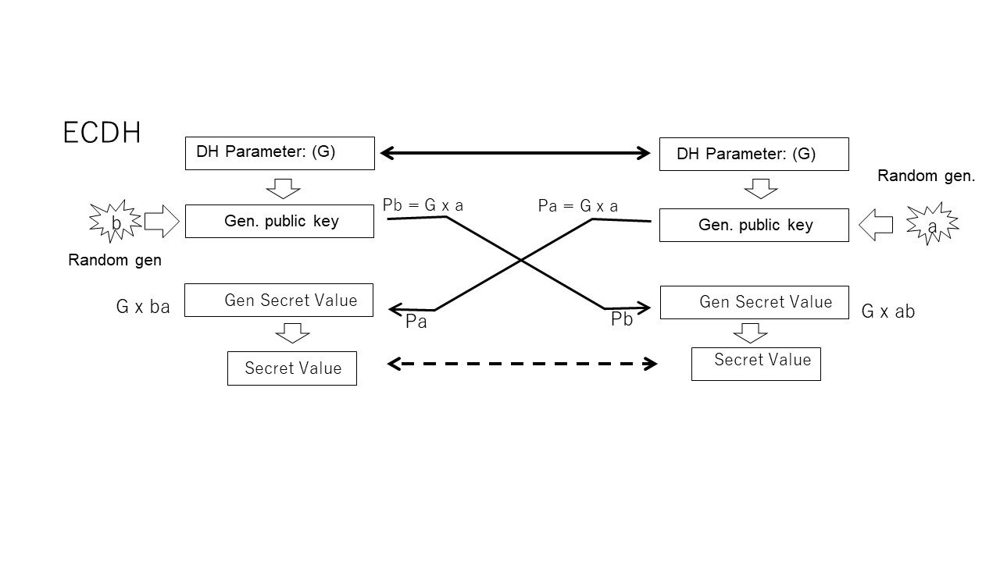
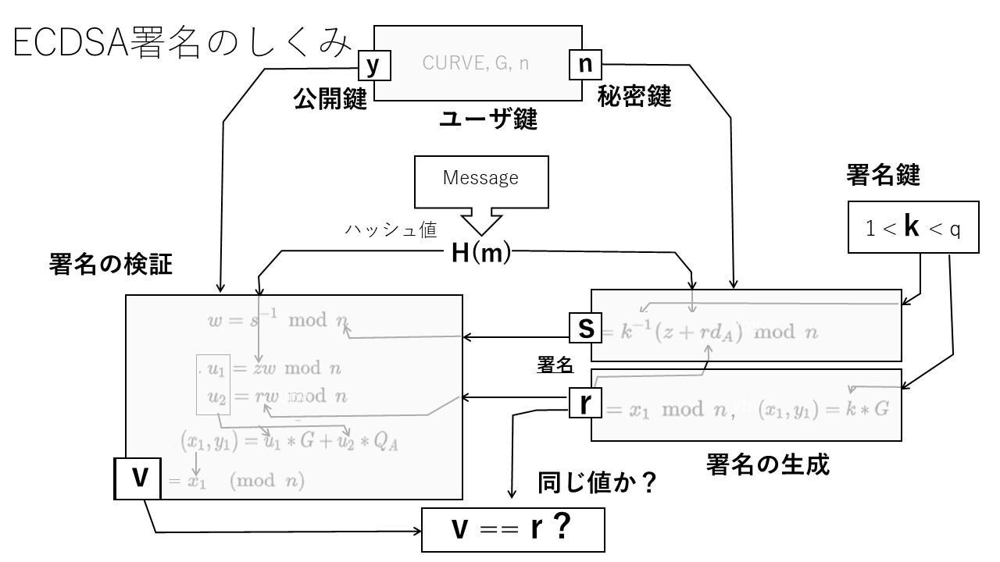

## 3.8 Elliptic curve cryptography

In "3.4 Public Key Cryptography", we explained public key cryptography in the world of integer arithmetic, but it is known that public key cryptography can also be realized by using the unidirectionality of discrete logarithmic operation on elliptic curves. Elliptic curve cryptography is becoming more important as the attacker's computing power increases and stronger cryptography is required, because even with a key length that is significantly shorter than the public key obtained by integer arithmetic, cryptography of the same or higher level can be obtained. I am.

 
[Table 3-7-0: Key length and encryption strength](./table3-7-0.md)
 

Initially, elliptic curve cryptography tended to be a little more complicated to realize than integer arithmetic, and there was a problem with processing speed, but it is possible to obtain the same cryptographic strength with a significantly shorter key and a more efficient curve. Research on realization methods has also progressed, and today there are significant improvements in processing performance.

### 3.8.1 Principle

Elliptic curve cryptography first defines operations on elliptic curves. An elliptic curve is not an ellipse that you usually think of intuitively, but a set of xy coordinate points that satisfies the following mathematically generalized cubic polynomial.

 

This set of coordinate points is a curve as shown in Figure 3-7-1. First, define the addition of points a and b on this curve. The point of symmetry (point of -y) with respect to the x-axis of point c where the straight line passing through a and b intersects the ellipse is the addition result of a + b.

When the addition is defined in this way, a point twice a is equivalent to the case where a and b have the same value in the addition, that is, the same coordinate point on the graph. If the curve is smooth in an intuitive sense, the differential value (slope) and tangent line of any coordinate on the curve are determined to be one, so the x-axis symmetry point of the point that intersects the curve on the extension of that line is determined. If so, the point a is doubled. Therefore, if this is repeated n times, the coordinates of a times n, that is, the scalar times of any coordinate point can be obtained.

Furthermore, if ax2 is found as described above, the power multiplication of a 2 can be found without repeating the addition. It can also be seen that if these are combined appropriately, the scalar multiple operation can be realized more efficiently by combining some power operations and addition.

 

 

On the other hand, in the calculation of the scalar multiple n of the base point (G) and the base point on such an elliptic curve, it is extremely difficult to find the original point from the resulting coordinates x when n is a large number. It is also known to be a unidirectional operation.

#### x = nG

In other words, it is possible to realize public key cryptography in which the coefficient n is the private key and the resulting coordinate point x is the public key by using the unidirectionality of the scalar multiplication operation, and such an encryption algorithm is an elliptical curve cipher. I call it.

### 3.8.2 ECDH (Elliptic Curve Diffie Hermann)

By applying the scalar multiplication operation to the same structure as the DH explained in "3.6.3 Diffie-Hellman key exchange" as shown in Fig. 3.8.2, the Diffie-Hellman key exchange using an elliptic curve can be realized. Using the coordinates G (base point) on the elliptic curve, which is the origin of the operation, as a shared parameter, secret random numbers a and b are generated for each, as in the case of DH. At this time, a times G and b times G are calculated, but since it is extremely difficult to estimate a and b from these values, it can be passed to the other party as a public key. On the other side, both can get the same value by multiplying the received value by their own private key a or b.

If you look at the operation contents, you can see that the operations performed on each side differ only in the operation order, so the results match. In other words, the Diffie-Hellmann key exchange is established even in the world of elliptic curve cryptography.

#### abG == baG
 

#### Ephemeral Key

### 3.8.3 ECDSA (Elliptic Curve Digital Signature)

Since the cyclic group is not found in the calculation of the elliptic curve, it is not possible to use a method like RSA. However, digital signatures can be achieved by taking advantage of the unidirectionality of elliptic curve operations. As shown in Figure 3.8.3, ECDSA (Elliptic Curve Digital Signature) generates and verifies signatures with a structure similar to DSA.

First, the definition of the elliptic curve CURVE, the coordinate point G on the curve on which the calculation is based, and the maximum value n of the scalar coefficient are used as common parameters.

Choose a private key k in the range 1 to n-1. Originally, the value of k should be selected carefully, but that point is omitted here.

In signature generation, the signature values ​​r and s are obtained from the hash value H (m) of the message to be signed m and the private key k. r is the value for signature verification.

In signature verification, the verification value v is obtained from the hash value H (m) and the signature values ​​r and s. If this value matches r, you have verified that the message and signature are correct. If the message has been tampered with, the H (m) value will be different and the validation values ​​will not match. In addition, the value r also contributes to the calculation of the verification value v, so it is difficult to tamper with it.

Since all of these operations are a combination of unidirectional operations performed on the base point G on the CURVE curve defined at the beginning, it is not possible to reach the secret key k from r, s, etc.

### 3.8.4 Curve types and standard

The elliptic curve used for encryption must be standardized, and the user must use the same curve. Of course, the curve used does not have elements that cause vulnerabilities such as singular points, but it is also known that the calculation efficiency varies greatly depending on the type of curve. Not all elliptic curves represented by cubic expressions are suitable for cryptographic algorithms. Of the general elliptic curves, the curve represented by the remainder of prime numbers called the prime field and the binary Finait field with 2 votes have been deeply studied as curves for elliptic curve cryptography.

The National Institute of Standards and Technology (NIST), a US research institute, worked on standardizing the curves used for such elliptic curve cryptography at an early stage, and published a series of curves as recommended curves (SP 800-186: so-called NIST curves). ). The curves that NIST recommends to use as standard are also selected from the prime body and the body with 2 votes.

On the other hand, as an international activity, SECG (Standards for Efficient Cryptography Group) has announced recommended curves, and there are many that correspond to both curves. Based on these curves, the IETF defines the curves used for TLS and how they are used in RFC 4492.

#### ECC Brainpool (RFC 5639): Needs to be added

[Table 3-7-4: Elliptic Curve Standards in TLS (RFC 4492)](./table3-7-4.md)

### 3.8.5 New elliptic curve

v
RFC 7748