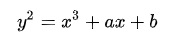
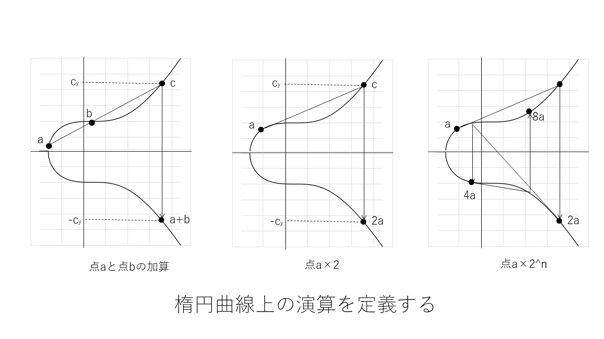
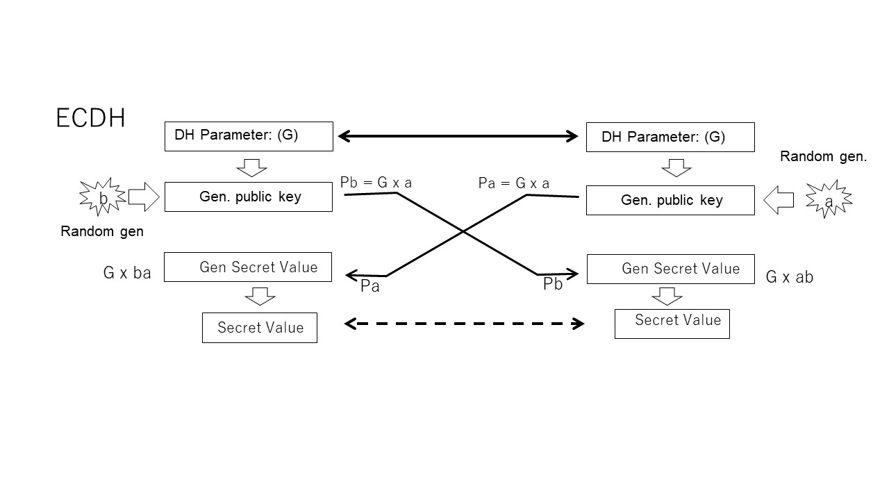
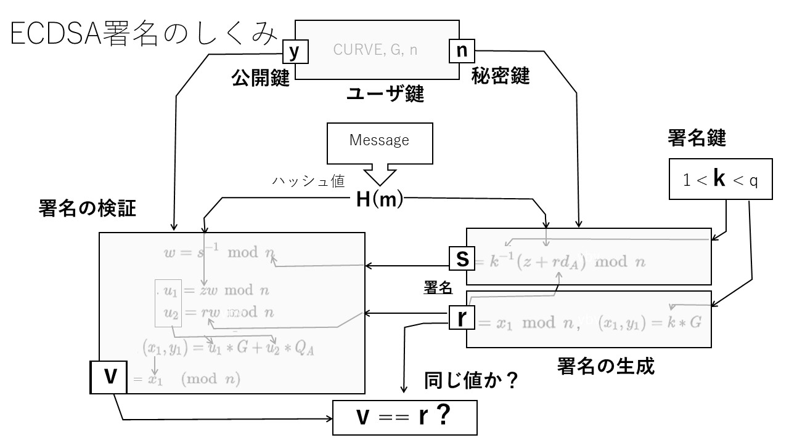

## 3.7 楕円曲線暗号

「3.4 公開鍵暗号」では整数演算の世界での公開鍵暗号について説明しましたが、楕円曲線上の離散対数演算の一方向性を利用することでも公開鍵暗号を実現できることが知られています。整数演算による公開鍵よりも大幅に短い鍵長でも同等以上の暗号強度が得られるので、攻撃側の計算能力が上がってより強い暗号強度が求めらる中で楕円曲線暗号の重要性は増してきています。

 
[Table 3-7-0: 鍵長と暗号強度](./table3-7-0.md)
 

楕円曲線暗号は初期には整数演算にくらべると実現がやや複雑になる傾向があって処理速度に課題がありましたが、大幅に短い鍵で同じ暗号強度を得ることができることやより効率的な曲線や実現手法の研究も進み、今日では処理性能の面でも大きく改善しています。

### 3.7.1 原理

楕円曲線暗号では、まず楕円曲線上の演算を定義します。楕円曲線といっても通常直観的に思い浮かべるような楕円ではなく、次のような数学的に一般化された三次多項式を満たすようなxy座標点の集合を扱います。

 

この点の集合は図3-7-1に示すような曲線になります。まず、この曲線の上の点aと点bの加算を、aとbを通る直線が楕円と交わるc点のx軸に対する対称の点 (-yの点) と定義します。

次に、このように定義すると、aの２倍の点は加算においてaとbが同じ値、つまりグラフ上の同じ座標点となった場合に相当します。直観的な意味で曲線がスムーズであれば、曲線上の任意の座標の微分値(傾き)、接線は一つに決まるので、その線の延長上で曲線に交わる点のx軸の対称点をとれば点aを２倍したことになります。従って、これをn回組あわせればaのn倍の座標、つまり任意の座標点のスカラー倍を求めることができることもわかります。

さらに、ax2がそのように求まるなら、aの2のべき乗倍の演算はn回繰り返さなくても図のように求まることになります。これを適当に組み合わせればスカラー倍の演算はいくつかのべき乗演算と加算の組み合わせでより効率的に実現できることもわかります。

 

 

一方、このような楕円曲線上の基になる点(G)、ベースポイントのスカラー倍nの演算は、nが大きな数になると結果の座標xから逆にもとの点を求めることは極めて難しくなる一方向演算であることも知られています。

#### x = nG

つまり、スカラー倍演算の一方向性を利用して、係数nを秘密鍵、結果の座標点xを公開鍵とする公開鍵暗号を実現することができ、このような暗号化アルゴリズムを楕円曲線暗号と呼んでいます。

### 3.7.2 ECDH(楕円曲線デフィーヘルマン)

「3.6.3 ディフィーヘルマン鍵交換」で説明したDHと同じ構造にスカラー倍演算を図3.7.2のようにあてはめて楕円曲線によるデフィーヘルマン鍵交換を実現することができます。演算の原点となる楕円曲線上の座標G（ベースポイント）を共有のパラメータとし、DHの場合と同じようにそれぞれに秘密の乱数値aとbを生成します。それぞれ、Gのa倍、Ｇのb倍を求めますがこの値からaやbを推定することは極めて難しいので、それを公開鍵として相手に渡すことができます。相手側では、それぞれ受け取った値に自分の秘密鍵aあるいはb倍すると共有の値を得ることができます。

演算内容を見てみると、それぞれの側で行っている演算は演算順序が違うだけなので結果は一致することがわかります。つまり、楕円曲線暗号の世界でもディフィーヘルマン鍵交換が成立しているのです。

#### abG == baG
 

### 3.7.3 ECDSA(楕円曲線デジタル署名)

楕円曲線の演算では落とし戸付き一方向性関数のような性質を持つ演算は見つかっていないのでRSAのような手法をとることはできません。しかし、楕円曲線演算の一方向性を利用してデジタル署名を実現することはできます。図3.7.3に示すようにECDSA(楕円曲線デジタル署名)ではDSAとほぼ同様の構造で署名の生成と検証を行います。

まず、楕円曲線の定義CURVE,演算のベースとなる曲線上の座標点Gとスカラー係数の最大値nを共通のパラメータとして使用します。

1からn-1の範囲で適当な秘密鍵 k を選びます。

署名生成では、署名対象メッセージmのハッシュ値H(m)と秘密鍵kから署名値rとsを求めます。rは署名検証用の値です。

署名検証では、ハッシュ値H(m)と署名値r、sから検証値vを求めます。この値がrと一致していれば正しいメッセージと署名であることが検証できたことになります。メッセージが改ざんされているとH(m)の値が異なり検証値が一致しません。

これらの演算はすべて最初に定めたCURVE曲線上のベースポイントGに対して行われる一方向演算の組み合わせなので、rやsなどから秘密鍵kにたどり着くことはできません。

### 3.7.4 曲線の種類と標準化

暗号に使用する楕円曲線はあらかじめ標準化しておき利用者が同じ曲線を利用する必要があります。使用する曲線は特異点など脆弱性の原因となるような要素がないことはもちろんですが、曲線の種類によって演算効率が大きく違ってくることも知られています。３次式であらわされる楕円曲線がすべて暗号化アルゴリズムに適しているわけではありません。一般的な楕円曲線のうち特に素体 (Prime Field) と呼ばれる素数の剰余であらわされる曲線と票数２の体 (Binary Field) が楕円暗号のための曲線として深く研究されています。

米国の研究機関NIST（National Institute of Standards and Technology）は早い段階でこうした楕円曲線暗号に使用する曲線の標準化にとりくみ、一連の曲線を推奨曲線として公表しています（SP 800-186: いわゆるNIST曲線）。NISTが標準的に使用を推奨される曲線も素体と票数２の体の中から選ばれています。

一方、国際的活動としてはSECG（Standards for Efficient Cryptography Group）が推奨曲線を発表しており、両者の曲線は対応しているものも多数あります。これらの曲線をベースにIETFではTLSに使用する曲線と利用方法に関してRFC 4492で定義しています。

#### ECC Brainpool (RFC 5639)：要加筆

[表3-7-4: TLSにおける楕円曲線の標準(RFC 4492)](./table3-7-4.md)

### 3.7.5 新しい楕円曲線

RFC 7748  

