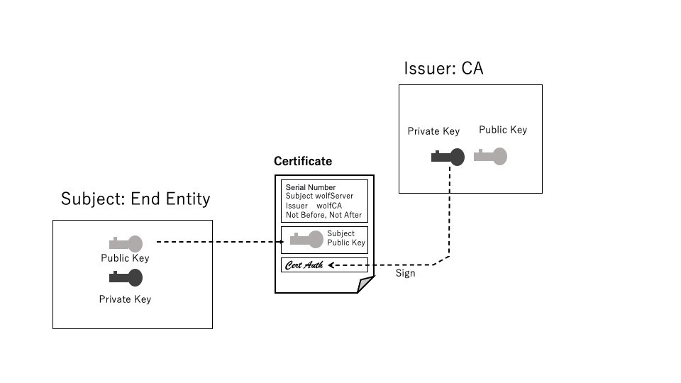

## 3.8 公開鍵証明書

### 3.8.1 原理
公開鍵証明書は、公開鍵をその所有者の同定、証明書の発行者、署名アルゴリズムなどの属性情報と結びつけるための証明書です。公開鍵は単なるバイナリデータで誰でも完全なコピーを作れてしまうため、公開鍵が所有者本人のものであることを証明するためには別途の方法が必要となります。それが公開鍵証明書です。公開鍵証明書には図3-8-1に示すように鍵の所有者の同定情報その他の属性情報と公開鍵そのもの、またこれら全体に対して署名した公開鍵署名が含まれます。

  

  

証明書に含まれている公開鍵は所有者(End Entity)の公開鍵で、対応するプライベート鍵は所有者によって他者から参照されないように適切に管理されます。また、署名は信頼するトレント(通常はCA:Certificate Autholity)が自分のプライベート鍵を使って署名します。

このようにして作成された証明書は、CAの公開鍵を使って証明書の署名の正当性を確認することで証明書がそのCAによって署名されたものであること、つまり証明書の真正性(証明書に含まれている公開鍵や所有者の同定情報その他が改竄されたものでないこと)が確認できます。

また、証明書の所有者に対しては、適当なチャレンジに対して所有者のプライベート鍵による署名を求め、その正当性を証明書に含まれている公開鍵でその正当性を確認することによって、真正な所有者であることを確認できます。

証明書の発行、正当性、失効などについては3.9 PKIで説明します。

### 3.8.2 証明書書式の標準
#### 1) X.509
ITUの定めるX.509は公開鍵証明書の標準規格としてもっとも広く普及、利用されています。X.509は最初のバージョンが1988年に公開、その後改訂されており、IETFではV3が参照されRFC3280として規定されています。

X.509では、証明書の基本的な属性情報として、バージョン、通し番号、アルゴリズムID、発行者情報、証明書の有効期間、主体者(公開鍵の所有者)情報を含みます。また、主体者の公開鍵情報として、公開鍵アルゴリズム、公開鍵自身を含みます。

#### 2) ASN.1

