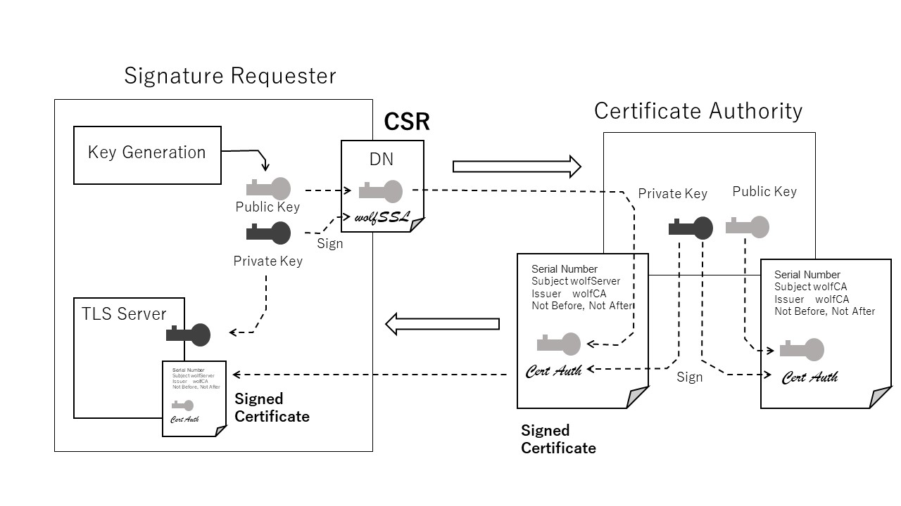
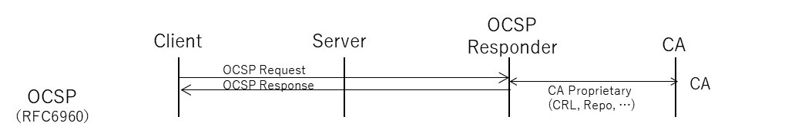
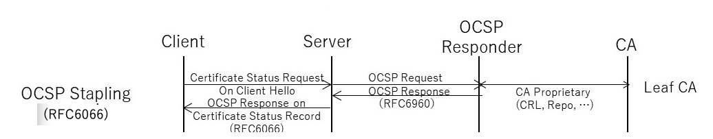
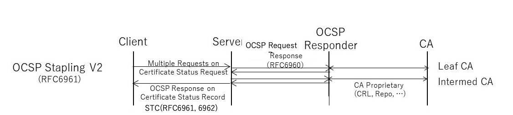
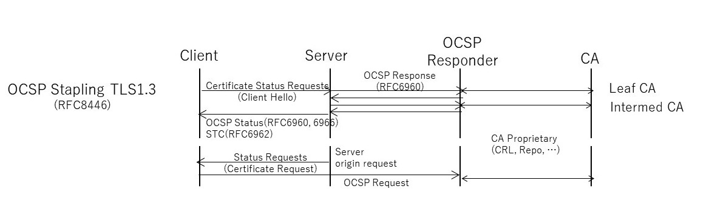

# 3.9 公開鍵基盤(PKI: Public Key Infrastructure)

## 3.9.1 PKCS

表3-1 TLSで参照される主なPKCS

## 3.9.2 公開鍵による信頼モデル
### 1) 信頼モデル

認証局同士の信頼関係のモデル。様々な組織が様々な信頼モデルに基づいて認証局を運用しているが、代表的な信頼モデルとして以下のものがある。

単独モデルは一つの認証局が全てのユーザに証明書を発行するモデルであり[6]、企業内の認証局などユーザ数が小規模な場合に用いられる。

階層型モデルは複数の認証局がツリー型の階層構造をなすモデルであり[6]、WebモデルはWebブラウザなどのクライアントアプリケーションに予め認証局の一覧を埋め込むモデルである[6]。

メッシュモデルは階層構造を持たない認証局が相互に認証しあうモデルであり[6]、異なる運用ポリシー(＝CPとCPSの記載内容)を持つ「CAドメイン」の間を横断して接続する際に使われる[8]。メッシュモデルでは異なるCAドメインにある認証局同士が相互に認証しあう相互認証でつながりあう[8]。相互認証で用いられる証明書を相互認証証明書という。

ブリッジCAモデルは認証局同士がブリッジCAという認証局を通して接続するモデルである[6]。メッシュモデルと同じく異なるCAドメイン間を結びつけるときに用いるが、各認証局が相互に認証しあうメッシュモデルと違い、各認証局は一つのブリッジCAとのみ相互認証する。これにより認証局1↔ブリッジCA↔認証局2というブリッジCAを媒介とした信頼関係が形成される。認証局の数が多い場合、認証局同士が直接相互認証するメッシュモデルでは相互認証の数が膨大になるが、ブリッジCAモデルではブリッジCAを媒介としたスター型のトポロジーの相互認証が形成されるのみなので、認証パスの数を減らすことができるという利点がある[9]。

## 3.9.3 証明書のライフサイクル

### 1) 証明書の発行
CSR(Certificate Signing Request)は、CAによる公開鍵証明書の発行を要求するためのフォーマットです。標準は、当初PKCS#10によって標準化され、RFC2986に引き継がれています。

サーバ認証を受けたいサーバなど公開鍵証明書を必要とする主体(Subject)はCSRによって認証局に対して公開鍵証明書の発行を要求することができます。CSRには主体者の公開鍵とアイデンテティ情報とともに、CSRの偽造を防ぐために主体者の秘密鍵による署名が含まれます。受け取ったCAは、これらの情報に証明書を識別できるシリアル番号、署名者としてのCAのアイデンテティ情報などを付加し、CAの秘密鍵により署名をします。

### 2) 証明書の正当性と失効
公開鍵証明書は、秘密鍵の流出など不測の事態には有効期限内でも失効させることができます。このため、受け取り側は受け取った証明書の有効性について確認する必要があります。証明書の有効性情報の入手は当初CRLやOCSPのようにTLSハンドシェークのスコープの外で実現されていました。OCSP Stapling ではハンドシェークの一部としてTLS拡張に取り込まれ、TLS1.3でそれらが整理され現在に至っています。

ここではその経緯を含めてまとめますが、現在ではOCSP Stapling v2以降の使用が推奨されます。また、TLSの基本的なピア認証プロトコルはクライアント、サーバでほぼ対称となっているのですが、クライアント認証におけるOCSPはTLS1.3で初めてサポートされました。

#### 2-1) CRL
初期の証明書有効性の管理メカニズムとしては、失効した証明書の一覧は証明書失効リスト(CRL: Certificate Revocation List) のフォーマットが標準化されました。クライアントはCRLを定期的に入手しておくことで、受け取った証明書の有効性を確認することができます。しかし、クライアント自身がCRL内の証明書情報を確認しなければならず、ネットワークの規模が大きくなりリストのサイズが大きくなるとクライアントにとって負担となってしまいます。

10-

#### 2-2) OCSP
クライアントのそのような負担を軽減するために、受け取った証明書だけに絞ってその有効性をOCSPレスポンダーに問い合わせるプロトコルとしてOCSP(RFC6960: Online Certificate Status Protocol)が開発されました。OCSPの場合、クライアントはOCSPレスポンダーに対して有効性を確認したい証明書のシリアルナンバーを送り、レスポンダーは問い合わせを受けた証明書についての確認結果を返却するのでクライアントの処理負荷が軽減されます。

しかし、このネットワーク構成ではレスポンダー側にトラフィックが過剰に集中してしまう点が大きな課題となってしまいました。また、レスポンダーがどのような形で失効情報を得るかについては規定されていないので、レスポンダーが参照する失効情報自身のリアルタイム性が保証されているわけではありませんでそた。

#### 2-3) OCSP Stapling
このように初期のOCSPでは証明書のステータス情報の入手にはTLSとは独立したプロトコルが規定されていました。しかし、その後開発されたOCSP Staplingでは、クライアントはOCSPレスポンダーではなくサーバに対してTLSハンドシェークの一環として証明書の有効性確認要求のプロトコルが標準化されました。これによってクライアントはサーバからの確認結果だけで証明書の有効性を判定できるようになりました。

具体的には、クライアントからの要求にはRFC6066でTLS拡張の一つとして追加された証明書ステータス要求(Certificate Status Request)を使用します。これに伴ってサーバからの応答としてハンドシェークレコードにCertificateStatusが追加されました。サーバはCertificateStatusレコードにOCSP Responseをのせることによって証明書ステータスを返却します。

#### 2-4) OCSP Stapling Version 2
通常、CAは階層構造を構成していて、それに対応した複数の証明書がチェーンされます。有効性確認は中間CAを含めた証明書についても行う必要がありますが、TLS1.2では一つのClientHelloには一つの証明書ステータス要求拡張しか設けられないという制限があり、中間CA証明書のステータスを含めて要求することができませんでした。

これを解決するためOCSP Stapling バージョン2 として、RFC6961(Multiple Certificate Status Request Extension)で規定が修正拡張されました。バージョン2ではサーバは直接CAに対して有効性確認時のタイムスタンプもクライアントに応答します(RFC6962: Signed Certificate Timestamp)。これによって、クライアントはレスポンスの鮮度を含めて証明書の有効性を確認することができるようになりました。サーバ側も鮮度が許す限りCAへの有効性確認要求を束ねることができるので、問い合わせに対応するCAの負荷を大幅に削減することができるようになりました。

#### 2-5) TLS1.3のOCSP Stapling
TLS1.3では、複数OCSPレスポンダーの証明書ステータスが存在できるようになりこの障害がなくなりました。このためTLS1.3ではクライアントからのステータス確認要求においてはRFC6961の規定する複数証明書ステータス拡張は廃止され、当初のRFC6066の証明書ステータス要求のほうが採用されています。サーバからのレスポンスもCertificate Entry拡張内に対応する証明書とともにRFC6066に準拠したOCSP Responseが設けられました。

TLS1.3ではリクエストとレスポンスのためのTLS拡張が整理されたことにより、サーバからクライアントに対しても同様の証明書ステータス要求を出すこともできるようになりました。この場合、サーバはCertificateRequestにstatus_requesを乗せて要求を出します(RFC8446 Section 4.4.2.1)。

