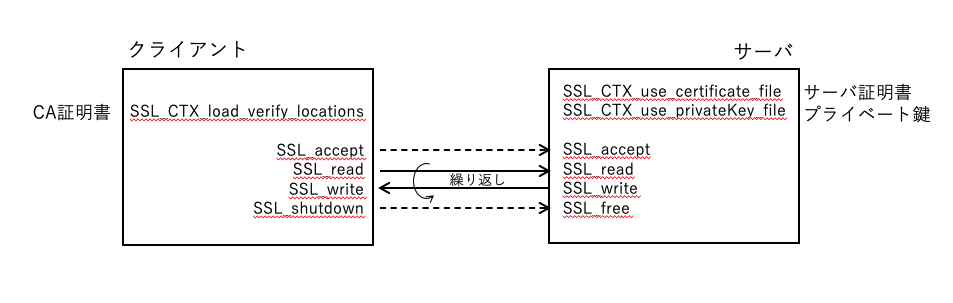
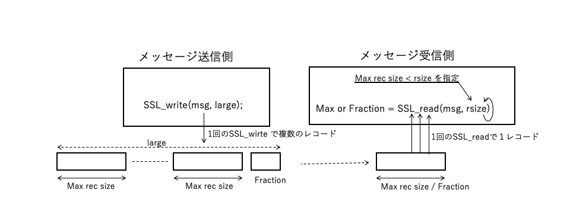
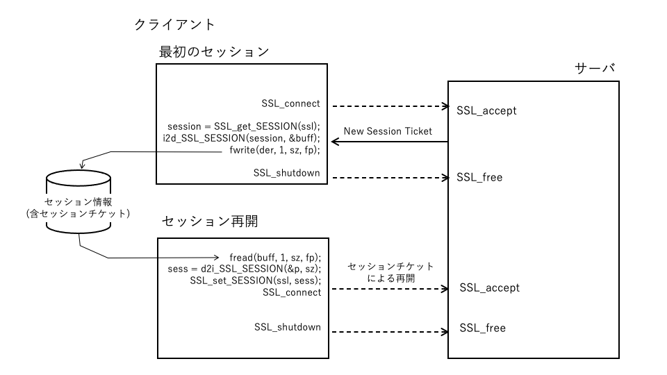

# Part2. Progressing

## Introduction
### 1) Sample program
In each chapter from now on, we will explain sample programs related to typical processing by dividing into TLS, encryption technology, and public key technology.
In each session, we will summarize the functional outline of the sample program, the C language code, the API used there, and related information. The code of the sample program will be introduced in a omitted form for details such as error handling due to space limitations. An executable sample program including error handling can be downloaded from the linked site (...).

--Chapter 6: TLS Protocol
--Chapter 7: Cryptographic Algorithm
--Chapter 8: Public Key and PKI

### 2) OpenSSL / wolfSSL
Unless otherwise noted, these sample source codes work in the same way with both OpenSSL and wolfSSL.


### 3) Header file
The sample program introduced in this document includes the following header files. It contains logic that is commonly used in each program.

Examples / include / example_common.

--Header file for C standard library
--Header file for BSD Socket library
--Callback to get TLS 1.3 session key
Refer to "Part4 Appendix 1 Programming Environment 2) Debugging Tool" for how to use it.

### 4) How to build
  For the build method, refer to "Part 4 Appendix 1 Programming Environment 1) Building Sample Program".


Twice

<br> <br> <br> <br>

<div style = "page-break-before: always"> </ div>

## 6.1 Client / Server Communication

### 6.1.1 Functional overview:
This sample performs simple application message communication between the client and server via TLS connection. Specify the IP address of the communication partner in the command argument of the client. If there is no argument, it will communicate to the local host (127.0.0.1).

After establishing a TLS connection with the server, the client sends a message from standard input to the server. The server prints the received message to standard output and sends the specified message back to the client. The client prints the message returned by the server to standard output. The client repeats this as long as there is an input message. The server will also reply as long as there is a message from the client. If the client's input message is "shutodwn", the client sends it to the server, then disconnects the TLS connection and terminates the process. If the server also receives a "break", the process ends.

Perform peer authentication for TLS connections. In the sample program, the client side authenticates the server, and the server side responds to the authentication request. Therefore, register the CA certificate on the client side and the server certificate and private key on the server side in advance.
<br> <br>

<br> <br>
<div style = "page-break-before: always"> </ div>

### 6.1.2 Program
 1) Client


`` ```
#include <openssl / ssl.h>

#define constant definition

int main (int argc, char ** argv)
{
    Definition of variables for sockets and messages

    SSL_CTX * ctx = NULL; / * SSL context * /
    SSL * ssl = NULL; / * SSL object * /

    Library initialization

    / * Secure SSL context and load CA certificate * /
    ctx = SSL_CTX_new (SSLv23_client_method ());
    SSL_CTX_load_verify_locations (ctx, CA_CERT_FILE, NULL);

    Secure TCP socket, TCP connection to server

    / * Create SSL object, attach socket, SSL connection to server * /
    ssl = SSL_new (ctx);
    SSL_set_fd (ssl, sockfd);
    SSL_connect (ssl);

    / * Application layer messaging * /
    while (1) {
        Enter an outgoing message
        SSL_write (ssl, msg, sendSz);

        If "break", break

        SSL_read (ssl, msg, sizeof (msg) ―― 1);
        Output received message
    }
cleanup:
    Release resources
}
`` ```

---

 2) Server


`` ```
#include <openssl / ssl.h>
#define constant definition

int main (int argc, char ** argv)
{
    Definition of variables for sockets and messages
    SSL_CTX * ctx = NULL; / * SSL context * /
    SSL * ssl = NULL; / * SSL object * /

    Library initialization

    / * Secure SSL context and load server certificate and private key * /
    ctx = SSL_CTX_new (SSLv23_server_method ());
    SSL_CTX_use_certificate_file (ctx, SERVER_CERT_FILE, SSL_FILETYPE_PEM);
    SSL_CTX_use_PrivateKey_file (ctx, SERVER_KEY_FILE, SSL_FILETYPE_PEM) l

    Secure TCP socket, bind, listen

    while (1) {
        connd = accept () / `TCP accept * /

        / * Create SSL object, attach socket, accept * /
        ssl = SSL_new (ctx);
        SSL_set_fd (ssl, connd);
        SSL_accept (ssl);

        / * Application layer messaging * /
        while (1) {
            SSL_read (ssl, msg, sizeof (msg) ―― 1);

            Output received message
            If "break", break

            SSL_write (ssl, msg, sendSz);
        }
    }
cleanup:
    Release resources
}
`` ```
### 6.1.3 Program description:

#### 1) Header file
#Include "openssl / ssl.h": Definitions of API, data type, etc. used in the TLS program are included.

#### 2) Management structure and pointer
--SSL_CTX * ctx; <br>
   A structure for managing a series of TLS connection processes (contexts). Manage multiple TLS connections under similar conditions, such as TLS connections to the same server, as a single context.

--SSL * ssl; <br>
It is a structure for managing one TLS connection.

--Securing and releasing structures <br>
    --Secure: SSL_CTX_new (), SSL_new ()
    --Release: SS * _CTX_free (), SSL_free ()

--Related information <br>
The main information associated with the SSL_CTX context is as follows. <br>
    --TLS version: <br>
        When securing the context, specify the protocol version for TLS connection in the SSL_CTX_new argument.
        (See Table 6.1.1 SSL_CTX_new methods, Table 6.1.2 Key APIs related to TLS versioning)
    --Peer authentication: <br>
        Load the CA certificate for authentication, the certificate of the local node, the private key, etc. before connecting (see Table 6.1.3 APIs related to peer authentication).
    --Socket used for TLS connection <br>
    Associate the socket used for TLS connection with SSL with the SSL_set_fd function.
<br> <br> <br>


#### 3) Main API
--SSL_CTX_load_verify_locations <br>
This example loads the CA certificate into the TLS context on the client side for server authentication. It is also used on the server side for client authentication. (See Table 6.1.3 APIs related to peer authentication for related APIs)

--SSL_CTX_use_certificate_file <br>
In this example, the server side loads the server certificate into the TLS context for server authentication. Also used on the client side for client authentication. (See Table 6.1.3 APIs related to peer authentication for related APIs)

--SSL_CTX_use_privateKey_file <br>
This example loads the private key into the TLS context on the server side for server authentication. Also used on the client side for client authentication. (See Table 6.1.3 APIs related to peer authentication for related APIs)

--SSL_connect <br>
An API that requests a TLS connection from the client to the server. When the TCP connection with the server is completed, specify the SSL secured by SSL_new and request the connection with this API. Handshake such as TLS version, cipher suite agreement, server authentication, etc. If all processing is completed normally, this API will return a normal completion.

--SSL_accept <br>
An API that accepts TLS connection requests from clients. With the connection completed by the TCP connection request from the client, specify the SSL secured by SSL_new and accept the connection request with this API. Hand shakes such as TLS version and cipher suite agreements, and client authentication if necessary. If all processing is completed normally, this API will return a normal completion.

--SSL_write <br>
Encrypts and sends an application message of the specified length to the other party of the connection. If the transmission is completed normally, the same value as the specified message length will be returned.

--SSL_read, SSL_pending <br>
Receives application messages with the specified maximum length or less from the other party of the connection, decrypts them in a buffer, and stores them. If the reception is completed normally, the number of bytes of the received message is returned. SSL_pending returns the number of bytes in the incoming message that is currently pending. SSL_read can read this number of bytes of messages non-blocking.
<br> <br>
#### 4) Process flow
#### Client

--Library initialization <br>
 Call SL_library_init () at the beginning of the program to initialize the library.

--Securing the TLS context <br>
Secure one context with SSL_CTX_new. At this time, specify the TLS version to be used for the connection (see Table 6.1.1 SSL_CTX_new method). It also loads the CA certificate for server authentication.

--Socket reservation and TCP connection <br>
Request to secure a socket and TCP connection with the server by socket and connect.

--Secure SSL and request TLS connection <br>
Secure the SSL connection management structure with SSL_new. Associate the socket with SSL with SSL_set_fd.
Request a TLS connection with SSL_connect.

--Application message <br>
Use SSL_write and SSL_read to send and receive application messages.

--Disconnect and release resources <br>
Disconnect TLS and TCP, release resources. Execute in the reverse order of securing, TLS disconnection and SSL release, socket release, and context release.

<br> <br>
#### Server
The processing flow on the server side is almost the same as that on the client side. The parts that differ from the client side are explained below.

--Securing the TLS context <br>
Since it will be the side that receives the server authentication request, load the server certificate and private key.

--TCP, TLS connection <br>
Since it will be the side that accepts connection requests, call listen, accept and SSL_accept.

--Application message <br>
Similar to the client side, SSL_read and SSL_write are called, but sending and receiving are in reverse order.
<br> <br>

#### 5) Other precautions
To ensure the security of TLS, the following correspondence is maintained for messages communicated by SSL_write and SSL_read.

By default, a single SSL_write call sends a message as a single TLS record. A message in one TLS record is SSL_readed once or multiple times. If the message length specified by SSL_read is the same as or longer than the sender, it will be received once. If the size of the TLS record sent is longer than the message size specified by SSL_read, the remaining amount will be received by the next SSL_read.

On the other hand, even if the specified size of SSL_read is long, multiple records sent by multiple SSL_write calls will not be received together by one SSL_read.

<br> <br>

<br> <br>

TLS records can be up to 16 kbytes. If SSL_wirte specifies a message larger than 16 kbytes, the message is split into 16 kbytes x n records and the remaining message records to send multiple records. In contrast, SSL_read reads one record for each API call. Therefore, you must specify a maximum record size of 16 kbytes for the message size and call the API multiple times.

If you specify MAX Fragment and specify a smaller maximum size for TLS records, the above record size will also be that size.

If SSL_MODE_ENABLE_PARTIAL_WRITE is specified in SSL_CTX_set_mode, SSL_write will send only part of the message and return the number of bytes if the entire message cannot be sent due to the status of the send process.

<br> <br>

<br> <br>

See #### 6.1.4


| Classification | Name | Description |
|:--- |:--- |:--- |
| Server | SSLv23_server_method | Connect with the highest version supported by both |
|| TLSv1_3_server_method | Connect with TLS 1.3 |
|| TLSv1_2_server_method | Connect with TLS 1.2 |
|| TLSv1_1_server_method | Connect with TLS 1.1 |
|| TLSv1_server_method | Connect with TLS 1.0 |
| Client | SSLv23_client_method | Connect with the highest version supported by both |
|| TLSv1_3_client_method | Connect with TLS 1.3 |
|| TLSv1_2_client_method | Connect with TLS 1.2 |
|| TLSv1_1_client_method | Connect with TLS 1.1 |
|| TLSv1_client_method | Connect with TLS 1.0 |
Server / Client | SSLv23_method | Connect with the highest version supported by both |
|| TLSv1_3_method | Connect with TLS 1.3 |
|| TLSv1_2_method | Connect with TLS 1.2 |
|| TLSv1_1_method | Connect with TLS 1.1 |
|| TLSv1_method | Connect with TLS 1.0 |


Table 6.1.1 SSL_CTX_new methods
<br> <br>

| Classification | Name | Description |
| --- | --- | --- |
| Settings | SSL_CTX_set_min_proto_version | Specify the lowest protocol version to use |
|| SSL_CTX_set_max_proto_version | Specify the highest protocol version to use |
| Reference | SSL_CTX_get_min_proto_version | Refer to the lowest configured protocol version |
|| SSL_CTX_get_man_proto_version | See the highest protocol version configured |

Table 6.1.2 Key APIs related to TLS versioning
<br> <br>

| Role | Function | Specified unit | With file system | Without file system |
|:--- |:--- | --- |:--- |:--- |
Authenticator | Load CA Certificate | Context | SSL_CTX_load_verify_locations | SSL_CTX_load_verify_buffer |
|| Specifying verification behavior | Context | SSL_CTX_set_verify | SSL_CTX_set_verify |
|| Specifying the depth of the certificate chain | Context | SSL_CTX_set_verify_depth | SSL_CTX_set_verify_depth |
Authenticated side | Load node certificate | Context | SSL_CTX_use_certificate_file | SSL_CTX_use_certificate_buffer |
||| Session | SSL_use_certificate_file | SSL_use_certificate_buffer |
|| Loading Private Key | Context | SSL_CTX_use_privateKey_file | SSL_CTX_use_privateKey_buffer |
||| Session | SSL_use_privateKey_file | SSL_use_privateKey_buffer |


Table 6.1.3 APIs related to peer authentication
<br> <br> <br> <br>

<div style = "page-break-before: always"> </ div>

# 6.2 Pre-shared key (PSK)

### 6.2.1 Feature overview:
In this sample, TLS connection is performed using a pre-shared key and message communication is performed using TLS. The message communication part is the same as the client / server sample program.


<br> <br>

<br> <br>

### 6.2.2 Program
 1) Client


```
/ * PSK client callback * /
static inline unsigned int my_psk_client_cb (SSL * ssl, const char * hint,
        char * identity, unsigned int id_max_len, unsigned char * key,
        unsigned int key_max_len)
{
    strncpy (identity, key ID, len);
    key = pre-agreed key;
    return key length;
}


int main (int argc, char ** argv)
{

    / * Secure SSL context and load CA certificate * /
    ctx = SSL_CTX_new (SSLv23_client_method ());


    / * PSK callback registration * /
    SSL_CTX_set_psk_client_callback (ctx, my_psk_client_cb);

    Below, the same as the client sample
     ...

cleanup:
    Release resources
}
```


 2) Server


```

/ * PSK server callback * /
static unsigned int my_psk_server_cb (SSL * ssl, const char * identity,
                           unsigned char * key, unsigned int key_max_len)
{
    Select the key to use from the received identity
    return Return the key length;
}


int main (int argc, char ** argv)
{
    / * Secure SSL context and load server certificate and private key * /
    SSL_CTX_new (SSLv23_server_method ());

    / * PSK callback registration * /
    SSL_CTX_set_psk_server_callback (ctx, my_psk_server_cb);

    Below, the same as the server sample

cleanup:
    Release resources
}
```

6.2.3 Program description:
1) Header file
#Include "openssl / ssl.h": Definitions of API, data type, etc. used in the TLS program are included.

2) Structures and APIs
-　SSL_CTX * ctx, SSL * ssl
See 6.1 Client / Server Communication

-　Securing and releasing structures
See 6.1 Client / Server Communication

-　Callback function<br>

Client side: SSL_CTX_set_psk_client_callback<br>
Register the client-side callback function with the second argument. The callback function is called to get the pre-key and ID when calling SSL_connect. The pre-key is retained on the client side and only the ID is sent to the server side. 

Server side: SSL_CTX_set_psk_server_callback<br>
Register the server-side callback function with the second argument. The callback function is called during SSL_accept call-time processing. Since the ID received from the client is passed as an argument, the callback process returns the pre-key corresponding to the ID.


# 6.3 Session resume

### 6.3.1 Feature overview:
In this sample, message communication is performed by restarting the session. For the first session, you will receive a session ticket from the server and save it in a file. The session resume client reads the session information saved in the file and uses it to resume.


<br> <br>


<br> <br>


### 6.3.2 Program
 1) First session


`` ```
/ * Save session + /
static int write_SESS (SSL * ssl, const char * file)
{
    session = SSL_get_SESSION (ssl);
    sz = i2d_SSL_SESSION (session, & buff);
    fwrite (der, 1, sz, fp);
    Resource release
}

int main (int argc, char ** argv)
{

    / * Secure SSL context, load CA certificate * /
    ctx = SSL_CTX_new (SSLv23_client_method ());

    ...

    SSL_connect (ssl);

    whiel (1) {
        / * Message input * /
        SSL_write (ssl, msg, sendSz));

        write_SESS (ssl); / * Save session * /


    Below, the same as the client sample
     ...

cleanup:
    Release resources
}
`` ```


 2) Resume session


`` ```

/ * Read session * /
static int read_SESS (const char * file, SSL * ssl)
{

    sz = file size; buff = malloc (sz);
    fread (buff, 1, sz, fp);
    p = buff;
    sess = d2i_SSL_SESSION (& p, sz);
    SSL_set_SESSION (ssl, sess);
    Resource release
}

int main (int argc, char ** argv)
{
    / * Secure SSL context and load server certificate and private key * /
    ctx = SSL_CTX_new (SSLv23_server_method ());

    ssl = SSL_new (ctx);

    read_SESS (ssl); / * Read session * /
    ...
    SSL_connect (ssl);

    Below, the same as the client sample

cleanup:
    Release resources
}
`` ```
### 6.3.3 Program description:


#### 1) Header file
#Include "openssl / ssl.h": Definitions of API, data type, etc. used in the TLS program are included.

#### 2) Main management structures and APIs
--SSL_CTX * ctx, SSL * ssl <br>
See 6.1 Client / Server Communication

--Securing and releasing structures <br>
See 6.1 Client / Server Communication

--SSL_SESSION * <br>
    --A structure that extracts and manages a set of information required for session restart, such as session tickets, from the connection information managed by the SSL structure.

--Securing, setting and releasing structures <br>
    --Secure: SSL_get_SESSION () <br>
        Extract the set of data required to restart the session from the connection information of the SSL structure in the form of the SSL_SESSION structure. At that time, the required area is secured in the SSL_SESSION structure and the pointer is returned. SSL_get_SESSION is called after the client executes SSL_connect while a secure TLS connection is in place.
    --Setting: SSL_set_SESSION () <br>
        Set the SSL_SESSION structure retrieved by SSL_get_SESSION to the SSL structure for session restart. Call SSL_set_SESSION before doing SSL_connect on the client.
    --Release: SSL_SESSION_free () <br>
        Releases the pointer of the SSL_SESSION structure.
‥
--Structure data conversion <br>
    --From ANS1 format to internal format: d2i_SSL_SESSION <br>
        d2i_SSL_SESSION reconstructs the data of the SSL_SESSION structure saved in ASN1 format into the internal format SSL_SESSION structure and returns the pointer.

    --From internal format to ASN1 format: i2d_SSL_SESSION <br>
        i2d_SSL_SESSION converts internal format SSL_SESSION structure data to ASN1 format data. The conversion data allocates and sets the required memory for the pointer passed in the second argument. The return value of the function returns the length required for ASN1 format conversion. Even if NULL is passed as the second argument, the return value of the function returns the length required for ASN1 format conversion.

#### 3) Process flow
##### First session
Establishes an SSL connection and sends and receives TLS messages to and from the server in the same way as the client in "6.1 Client-Server Communication".

After sending the TLS message, if the send command is "break", the session management information to be used for session restart is saved in a file. Session management information is extracted with the SSL_SESSION structure with SSL_get_SESSION, converted to ASN1 format with i2d_SSL_SESSION, written to the file, and the TLS connection is terminated.

##### Session resume
Reads the session management information stored in the file and sets it in the SSL structure so that the session can be restarted at the time of TLS connection. Convert from ASN1 format to internal format with d2i_SSL_SESSION. Set the converted SSL_SESSION structure to the SSL structure with SSL_set_session.

After that, it establishes an SSL connection and sends and receives TLS messages to and from the server in the same way as the client in "6.1 Client-Server Communication".

<br> <br> 
More about this source textSource text required for additional translation information
Send feedback
Side panels


