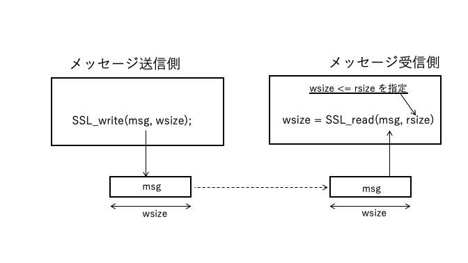
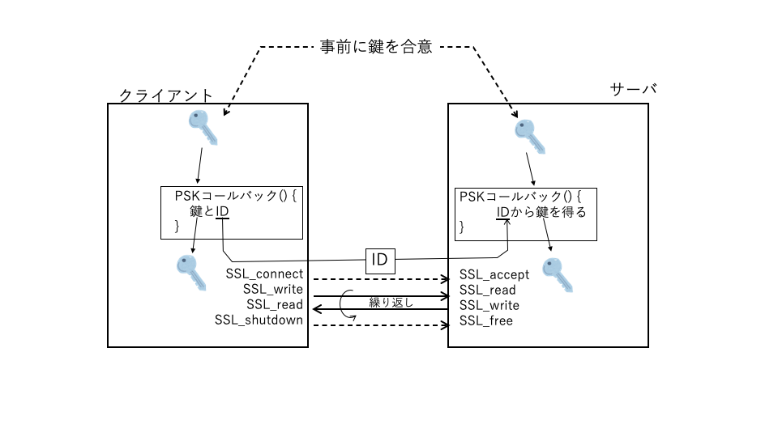

# Part2. プログミング

## はじめに
### 1) サンプルプログラム
　これからの各章ではTLSや暗号技術、公開鍵技術にわけて典型的な処理に関するサンプルプログラムについて解説します。
各セッションでは、サンプルプログラムの機能概要、C言語のコード、そこで利用されるAPI、また関連する情報についてまとめます。サンプルプログラムのコードは紙面の都合でエラー処理など詳細に関しては省略した形で紹介します。エラー処理を含む実行可能なサンプルプログラムは連携サイト(...)からダウンロードすることができます。

- 第6章：TLSプロトコル
- 第7章：暗号アルゴリズム
- 第8章：公開鍵とPKI

### 2) OpenSSL/wolfSSL
これらのサンプルソースコードは特に断りのない限り、OpenSSL, wolfSSLの両者で同様の動作をします。


### 3) ヘッダーファイル
本書で紹介するサンプルプログラムでは下記のヘッダーファイルをインクルードします。この中には各プログラムで共通に使われるロジックが含まれています。

Examples/include/example_common.

- C言語標準ライブラリーのためのヘッダーファイル
- BSD Socketライブラリーのためのヘッダーファイル
- TLS1.3のセッション鍵を得るためのコールバック
　使い方は 「Part4 付録1 プログラミング環境 2) デバッグツール」を参照。

### 4) ビルド方法
  ビルド方法は「Part4 付録1 プログラミング環境 1) サンプルプログラムのビルド」を参照。


　

<br><br><br><br>

<div style="page-break-before:always"></div>  

## 6.1 クライアント・サーバ通信

### 6.1.1 機能概要：
　　このサンプルはクライアントとサーバの間でTLS接続による簡単なアプリケーションメッセージ通信を行います。クライアントのコマンドアーギュメントで通信相手のIPアドレスを指定します。アーギュメントが無い場合はローカルホスト(127.0.0.1)に対して通信します。

クライアントはサーバとのTLS接続を確立した後、標準入力からのメッセージをサーバに送信します。サーバは受信したメッセージを標準出力に表示するとともに、所定のメッセージをクライアントに返送します。クライアントはサーバから返却されたメッセージを標準出力に表示します。クライアントは入力メッセージがある限りこれを繰り返します。サーバもクライアントからのメッセージがある限り、返信します。クライアントの入力メッセージが"shutodwn"の場合、クライアントはこれをサーバに送信した後、TLS接続を解除し処理を終了します。サーバ側も"break"を受信した場合、処理を終了します。

TLS接続の際にピア認証を行います。サンプルプログラムではクライアント側がサーバ認証を行い、サーバ側はその認証要求に応えます。そのために、クライアント側にはCA証明書、サーバ側にはサーバ証明書とプライベート鍵をあらかじめ登録しておきます。
<br> <br>

<br> <br>
<div style="page-break-before:always"></div>

### 6.1.2 プログラム
 1) クライアント


```
#include <openssl/ssl.h>

#define 定数定義

int main(int argc, char **argv)
{
    ソケット用変数, メッセージ用変数の定義

    SSL_CTX* ctx = NULL;    /* SSLコンテクスト */
    SSL*     ssl = NULL;    /* SSLオブジェクト */

    ライブラリの初期化 

    /*　SSLコンテクストの確保し、CA証明書をロード　*/
    ctx = SSL_CTX_new(SSLv23_client_method());
    SSL_CTX_load_verify_locations(ctx, CA_CERT_FILE, NULL);

    TCPソケットの確保、サーバにTCP接続

    /* SSLオブジェクトの生成、ソケットをアタッチ、サーバにSSL接続 */
    ssl = SSL_new(ctx);
    SSL_set_fd(ssl, sockfd);
    SSL_connect(ssl);

    /* アプリケーション層のメッセージング　*/
    while (1) {
        送信メッセージを入力
        SSL_write(ssl, msg, sendSz);

        "break" ならばbreak

        SSL_read(ssl, msg, sizeof(msg) - 1);
        受信メッセージを出力
    }
cleanup:
    リソースの解放
}
```

---

 2) サーバ


```
#include <openssl/ssl.h>
#define 定数定義

int main(int argc, char **argv)
{
    ソケット用変数, メッセージ用変数の定義
    SSL_CTX* ctx = NULL;    /* SSLコンテクスト */
    SSL*     ssl = NULL;    /* SSLオブジェクト */

    ライブラリの初期化 

    /*　SSLコンテクストの確保し、サーバ証明書、プライベート鍵をロード　*/
    ctx = SSL_CTX_new(SSLv23_server_method());
    SSL_CTX_use_certificate_file(ctx, SERVER_CERT_FILE, SSL_FILETYPE_PEM);
    SSL_CTX_use_PrivateKey_file(ctx, SERVER_KEY_FILE, SSL_FILETYPE_PEM)l

    TCPソケットの確保、bind, listen

    while(1) {
        connd = accept() /` TCP アクセプト */

        /* SSLオブジェクトの生成、ソケットをアタッチ、アクセプト */
        ssl = SSL_new(ctx);
        SSL_set_fd(ssl, connd);
        SSL_accept(ssl);

        /* アプリケーション層のメッセージング　*/
        while (1) {
            SSL_read(ssl, msg, sizeof(msg) - 1);

            受信メッセージを出力            
            "break" ならばbreak

            SSL_write(ssl, msg, sendSz);
        }
    }
cleanup:
    リソースの解放
}
```
### 6.1.3 プログラムの説明：

#### 1) ヘッダーファイル
　#include "openssl/ssl.h": TLSプログラムで使用するAPI、データタイプなどの定義が含まれています

#### 2) 管理構造体とポインタ
- SSL_CTX *ctx;<br>
   一連のTLS接続処理(コンテクスト)を管理するための構造体です。同じサーバへのTLS接続のような類似の条件での複数のTLS接続を一つのコンテクストとして管理します。

- SSL *ssl;<br>
　１つのTLS接続を管理するための構造体です。

- 構造体の確保と解放<br>
    - 確保：SSL_CTX_new(), SSL_new()
    - 解放：SS*_CTX_free(), SSL_free()

- 関連情報<br>
　SSL_CTXコンテクストに紐づけられる主な情報としては以下のようなものがあります。<br>
    - TLSバージョン:<br>
        コンテクストの確保時、SSL_CTX_newのアーギュメントでTLS接続時のプロトコルバージョンを指定します。
        (表6.1.1 SSL_CTX_new メソッド, 表6.1.2  TLSバージョン指定関連の主なAPI参照)
    - ピア認証：<br>
        認証のためのCA証明書、自ノードの証明書、プライベート鍵などを接続前にロードしておきます(表6.1.3   ピア認証関連のAPI参照)。
    - TLS接続に使用するソケット<br>
    SSL_set_fd関数でTLS接続に使用するソケットをSSLに紐付けます。 
<br><br><br>


#### 3) 主なAPI
- SSL_CTX_load_verify_locations<br>
この例では、サーバ認証のためにクライアント側でCA証明書をTLSコンテクストにロードします。クライアント認証のためにサーバ側でも使用します。(関連APIは表6.1.3 ピア認証関連のAPIを参照)

- SSL_CTX_use_certificate_file<br>
この例では、サーバ認証のためにサーバ側でサーバ証明書をTLSコンテクストにロードします。クライアント認証のためにクライアント側でも使用します。(関連APIは表6.1.3 ピア認証関連のAPIを参照)

- SSL_CTX_use_privateKey_file<br>
この例では、サーバ認証のためにサーバ側でプライベート鍵をTLSコンテクストにロードします。クライアント認証のためにクライアント側でも使用します。(関連APIは表6.1.3 ピア認証関連のAPIを参照)

- SSL_connect<br>
クライアントからサーバにTLS接続を要求するAPIです。サーバとのTCP接続が完了している状態で、SSL_newで確保したSSLを指定してこのAPIで接続を要求します。TLSバージョンや暗号スイートの合意、サーバ認証などのハンドシェークを行います。すべての処理が正常に完了するとこのAPIは正常終了を返却します。

- SSL_accept<br>
クライアントからのTLS接続要求を受け付けるAPIです。クライアントからのTCP接続要求で接続が完了している状態で、SSL_newで確保したSSLを指定してこのAPIで接続要求を受付ます。TLSバージョンや暗号スイートの合意、必要ならばクライアント認証などのハンドシェークを行います。すべての処理が正常に完了するとこのAPIは正常終了を返却します。

- SSL_write<br>
接続の相手方に対して指定された長さのアプリケーションメッセージを暗号化し送信します。正常に送信が完了した場合、指定したメッセージ長と同じ値を返却します。

- SSL_read, SSL_pending<br>
接続の相手方から指定された最大長以下のアプリケーションメッセージを受信しバッファーに復号化し、格納します。正常に受信が完了した場合、受信したメッセージのバイト数を返却します。SSL_pendingは現在ペンディンングとなっている受信メッセージのバイト数を返却します。SSL_readではこのバイト数分のメッセージをノンブロッキングで読み出すことができます。

<br><br>
#### 4) 処理の流れ
#### クライアント

- ライブラリ初期化<br>
 プログラムの冒頭でSL_library_init()を呼び出しライブラリを初期化します。

- TLSコンテクストの確保<br>
　SSL_CTX_newでコンテクストを一つ確保します。この時、接続に使用するTLSバージョンを指定します(表6.1.1 SSL_CTX_new メソッド参照)。また、サーバ認証のためのCA証明書をロードします。

- ソケット確保とTCP接続<br>
　socket、connectによってソケットの確保とサーバとのTCP接続を要求します。

- SSLの確保とTLS接続要求<br>
　SSL_newでSSL接続管理の構造体を確保します。SSL_set_fdでソケットをSSLに紐付けます。
SSL_connectでTLS接続を要求します。

- アプリケーションメッセージ<br>
　SSL_write、SSL_readで、アプリケーションメッセージの送信、受信を行ます。

- 切断とリソースの解放<br>
　TLSとTCPの切断、リソースを解放します。確保したときの逆の順序で、TLS切断とSSLの解放、ソケットの解放、コンテクストの解放の順序で実行します。

<br><br>
#### サーバ
サーバ側もクライアント側とほぼ同様の処理の流れとなります。以下、クライアント側と異なる部分を説明します。

- TLSコンテクストの確保<br>
サーバ認証要求を受ける側となるので、サーバ証明書、プライベート鍵をロードします。

- TCP, TLS接続<br>
　接続要求を受け付ける側となるので、listen、acceptおよびSSL_acceptを呼び出します。

- アプリケーションメッセージ<br>
　クライアント側と同様に、SSL_read, SSL_writeを呼び出しますが、送受信が逆順となります。
<br><br>

#### 5) その他の注意点
TLSのセキュリティを確保するために、SSL_write、SSL_readで通信するメッセージは以下のような対応関係を維持されます。

デフォルトでは、1回のSSL_write呼び出しによるメッセージは一つのTLSレコードとして送信されます。一つのTLSレコードのメッセージは１回ないし複数回のSSL_readします。SSL_readで指定するメッセージ長は送信側と同じか長い場合は１回で受信されます。送られてきたTLSレコードのサイズのほうがSSL_readで指定したメッセージサイズより長い場合には、残った分は次のSSL_readで受信されます。

一方、SSL_readの指定サイズが長い場合でも、複数回のSSL_write呼び出しで送信された複数のレコードをまとめて一つのSSL_readで受信することはありません。

<br> <br>

<br> <br>

TLSレコードは最大16kバイトです。SSL_wirteで16kバイトを超えるメッセージを指定した場合は、メッセージを16kバイト X n のレコードと残り分のメッセージのレコードに分割して複数のレコードを送信します。これに対して、SSL_readは１回のAPI呼び出しに対して１レコードを読み込みます。したがって、メッセージのサイズとして最大レコードサイズ16kバイトを指定し、複数回APIを呼び出す必要があります。

MAX Fragmentを指定してしてTLSレコードの最大サイズに小さいサイズを指定した場合は、上記のレコードサイズもそのサイズとなります。

SSL_CTX_set_modeでSSL_MODE_ENABLE_PARTIAL_WRITEが指定されている場合は、SSL_writeは送信処理の状況によってメッセージ全体が送信できない場合、一部だけ送信しそのバイト数を返却します。

<br> <br>

<br> <br>

####  6.1.4 参照


|分類|名前|説明|
|:---|:---|:---|
|サーバー|SSLv23_server_method|両者のサポートする最も高いバージョンで接続|
||TLSv1_3_server_method|TLS 1.3で接続|
||TLSv1_2_server_method|TLS 1.2で接続|
||TLSv1_1_server_method|TLS 1.1で接続|
||TLSv1_server_method|TLS 1.0で接続|
|クライアント|SSLv23_client_method|両者のサポートする最も高いバージョンで接続|
||TLSv1_3_client_method|TLS 1.3で接続|
||TLSv1_2_client_method|TLS 1.2で接続|
||TLSv1_1_client_method|TLS 1.1で接続|
||TLSv1_client_method|TLS 1.0で接続|
|サーバー/クライアント|SSLv23_method|両者のサポートする最も高いバージョンで接続|
||TLSv1_3_method|TLS 1.3で接続|
||TLSv1_2_method|TLS 1.2で接続|
||TLSv1_1_method|TLS 1.1で接続|
||TLSv1_method|TLS 1.0で接続|


表6.1.1 SSL_CTX_new メソッド
<br><br>

|分類|名前|説明|
|---|---|---|
|設定|SSL_CTX_set_min_proto_version|使用する最も低いプロトコルバージョンを指定|
||SSL_CTX_set_max_proto_version|使用する最も高いプロトコルバージョンを指定|
|参照|SSL_CTX_get_min_proto_version|設定済み最も低いプロトコルバージョンを参照|
||SSL_CTX_get_man_proto_version|設定済み最も高いプロトコルバージョンを参照|

表6.1.2  TLSバージョン指定関連の主なAPI
<br><br>

|役割|機能|指定単位|ファイルシステムあり|ファイルシステムなし|
|:---|:---|---|:---|:---|
|認証する側|CA証明書のロード|コンテクスト|SSL_CTX_load_verify_locations|SSL_CTX_load_verify_buffer|
||検証動作の指定|コンテクスト|SSL_CTX_set_verify|SSL_CTX_set_verify|
||証明書チェーンの深さ指定|コンテクスト|SSL_CTX_set_verify_depth|SSL_CTX_set_verify_depth|
|認証される側|ノード証明書のロード|コンテクスト|SSL_CTX_use_certificate_file|SSL_CTX_use_certificate_buffer|
|||セッション　|SSL_use_certificate_file|SSL_use_certificate_buffer|
||プライベート鍵のロード|コンテクスト|SSL_CTX_use_privateKey_file|SSL_CTX_use_privateKey_buffer|
|||セッション　|SSL_use_privateKey_file|SSL_use_privateKey_buffer|


表6.1.3 ピア認証関連のAPI
<br><br><br><br>

<div style="page-break-before:always"></div>

# 6.2 事前共有鍵(PSK)

### 6.2.1 機能概要：
　このサンプルでは、事前共有鍵によるTLS接続を行いTLSによるメッセージ通信を行います。メッセージ通信部分はクライアント・サーバサンプルプログラムと同様です。


<br> <br>

<br> <br>

### 6.2.2 プログラム
 1) クライアント


```
/* PSKクライアントコールバック */
static inline unsigned int my_psk_client_cb(SSL* ssl, const char* hint,
        char* identity, unsigned int id_max_len, unsigned char* key,
        unsigned int key_max_len)
{
    strncpy(identity, 鍵のID, len);
    key = 事前に合意した鍵;
    return 鍵長;
}


int main(int argc, char **argv)
{

    /*　SSLコンテクストの確保し、CA証明書をロード　*/
    ctx = SSL_CTX_new(SSLv23_client_method());


    /* PSKコールバックの登録 */
    SSL_CTX_set_psk_client_callback(ctx, my_psk_client_cb);

    以下、クライアントサンプルと同様
     ...

cleanup:
    リソースの解放
}
```


 2) サーバ


```

/* PSKサーバコールバック */
static unsigned int my_psk_server_cb(SSL* ssl, const char* identity,
                           unsigned char* key, unsigned int key_max_len)
{
    受け取ったidentityから使用する鍵を選択
    return 鍵長を返却;
}


int main(int argc, char **argv)
{
    /*　SSLコンテクストの確保し、サーバ証明書、プライベート鍵をロード　*/
    SSL_CTX_new(SSLv23_server_method());

    /* PSKコールバックの登録 */
    SSL_CTX_set_psk_server_callback(ctx, my_psk_server_cb);

    以下、サーバサンプルと同様

cleanup:
    リソースの解放
}
```
### 6.2.3 プログラムの説明：

#### 1) 
<br><br><br>


#### 3) 主なAPI
- SSL_CTX_set_psk_client_callback
- SSL_CTX_set_psk_server_callback

<br><br><br><br>

<div style="page-break-before:always"></div>

# 6.3 セッション再開

### 6.3.1 機能概要：
　このサンプルでは、セッション再開によるメッセージ通信を行います。最初のセッションではサーバからセッションチケットを受け取りファイルに保存しておきます。セッション再開のクライアントでは、ファイルに保存したセッション情報を読み出し、それを使用して再開します。


<br> <br>


<br> <br>


### 6.3.2 プログラム
 1)　最初のセッション


```
/* セッションを保存 +/
static int write_SESS(SSL *ssl, const char* file)
{
    session = SSL_get_SESSION(ssl);
    sz      = i2d_SSL_SESSION(session, &buff);
    fwrite(der, 1, sz, fp);
    リソース解放
}

int main(int argc, char **argv)
{

    /*　SSLコンテクスト確保、CA証明書ロード　*/
    ctx = SSL_CTX_new(SSLv23_client_method());

    ...

    SSL_connect(ssl);

    whiel(1) {
        /* メッセージ入力 */
        SSL_write(ssl, msg, sendSz));

        write_SESS(ssl);   /* セッションを保存 */


    以下、クライアントサンプルと同様
     ...

cleanup:
    リソースの解放
}
```


 2) セッション再開


```

/* セッション読み出し  */
static int read_SESS(const char* file, SSL* ssl)
{

    sz   = ファイルサイズ; buff = malloc(sz);
    fread(buff, 1, sz, fp);
    p    = buff;
    sess = d2i_SSL_SESSION(&p, sz);
    SSL_set_SESSION(ssl, sess);
    リソース解放
}

int main(int argc, char **argv)
{
    /*　SSLコンテクストの確保し、サーバ証明書、プライベート鍵をロード　*/
    ctx = SSL_CTX_new(SSLv23_server_method());

    ssl = SSL_new(ctx);

    read_SESS(ssl);　/* セッション読み出し */
    ...
    SSL_connect(ssl);

    以下、クライアントサンプルと同様

cleanup:
    リソースの解放
}
```
### 6.3.3 プログラムの説明：


#### 1) ヘッダーファイル
　#include "openssl/ssl.h": TLSプログラムで使用するAPI、データタイプなどの定義が含まれています

#### 2) 主な管理構造体とAPI
- SSL_CTX *ctx、SSL *ssl<br>
6.1 クライアント・サーバ通信を参照

- 構造体の確保と解放<br>
6.1 クライアント・サーバ通信を参照

- SSL_SESSION*<br>
    - SSL構造体で管理されている接続情報のうち、セッションチケットなどセッション再開で必要とされる情報一式を抽出し管理する構造体です。

- 構造体の確保、設定と解放<br>
    - 確保：SSL_get_SESSION()<br>
        SSL構造体の接続情報からセッション再開に必要なデータ一式をSSL_SESSION構造体の形で抽出します。そのときSSL_SESSION構造体に必要な領域を確保し、そのポインタを返却します。SSL_get_SESSIONはクライアントがSSL_connectを実行後、TLSの安全な接続が確保されている間に呼び出します。
    - 設定：SSL_set_SESSION()<br>
        SSL_get_SESSIONで取り出したSSL_SESSION構造体をセッション再開のためにSSL構造体に設定します。SSL_set_SESSIONはクライアントでSSL_connectを行う前に呼び出します。
    - 解放：SSL_SESSION_free()<br>
        SSL_SESSION構造体のポインタを解放します。
　　　　
- 構造体のデータ変換<br>
    - ANS1形式から内部形式へ : d2i_SSL_SESSION<br>
        d2i_SSL_SESSIONは、ASN1形式で保存されたSSL_SESSION構造体のデータを内部形式のSSL_SESSION構造体へ再構築し、そのポインタを返却します。

    - 内部形式からASN1形式へ : i2d_SSL_SESSION<br>
        i2d_SSL_SESSIONは、内部形式のSSL_SESSION構造体データをASN1形式のデータへ変換します。変換データは第2引数で渡されたポインタに必要なメモリを確保し設定します。関数の戻り値はASN1形式変換に必要な長さを返却します。第2引数にNULLが渡された場合でも、関数の戻り値はASN1形式変換に必要な長さを返却します。

#### 3) 処理の流れ
##### 最初のセッション
「6.1 クライアント・サーバ通信」のクライアントと同様にSSL接続を確立し、サーバとの間でTLSメッセージを送受信します。

TLSメッセージを送信後、送信コマンドが"break"の場合は、セッション再開で利用するためのセッション管理情報をファイルに保存します。セッション管理情報はSSL_get_SESSIONでSSL_SESSION構造体で抽出し、i2d_SSL_SESSIONでASN1形式へ変換後ファイルへ書き込み、TLS接続を終了します。

##### セッション再開
ファイルに保存されたセッション管理情報を読み込みTLS接続時にセッションを再開できるようにSSL構造体に設定します。d2i_SSL_SESSIONでASN1形式から内部形式に変換します。変換したSSL_SESSION構造体をSSL_set_sessionでSSL構造体に設定します。

その後、「6.1 クライアント・サーバ通信」のクライアントと同様にSSL接続を確立し、サーバとの間でTLSメッセージを送受信します。

<br><br>


